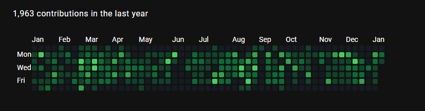

# GitHub Contributions Chart

This repository contains a simple API built using [FastAPI](https://fastapi.tiangolo.com/) that allows you to fetch and render the contributions chart of a GitHub user.

The API has a single endpoint, `/{username}/contributions`, which takes the following optional query parameters:
- `text_color`: The color of the text on the chart (default: 'white').
- `level_0`: The color of the squares representing days with no contributions (default: '#161b22').
- `level_1`: The color of the squares representing days with few contributions (default: '#0e4429').
- `level_2`: The color of the squares representing days with moderate contributions (default: '#006d32').
- `level_3`: The color of the squares representing days with many contributions (default: '#26a641').
- `level_4`: The color of the squares representing days with a lot of contributions (default: '#39d353').
- `get_image`: A boolean value that indicates whether the API should return the chart as an image or as HTML (default: False).

## Requirements
* Python 3.8 or later
* FastAPI
* GitHub API library

## Installation

1. Clone the repository and navigate to the created directory:
```
git clone https://github.com/AndreMPCosta/github-contrib-chart.git
cd github-contrib-chart
```

2. Install the required dependencies:
```
pip install pipenv
pipenv install
```

3. Create a .env file containing your allowed origins and hosts, and API port, separated by a comma
(skip the first two lines if you want everyone to access the API).
```
ALLOWED_ORIGINS=https://myawesomewebsite.com,http://localhost:9000
ALLOWED_HOSTS=*.myawesomewebsite.com,localhost
PORT=10000
```
## Usage

1. Start the API by running the following command:
```
pipenv run app
```

2. You can now make a GET request to `http://localhost:10000/{username}/contributions` to fetch the contributions chart of a GitHub user.


3. By default, the API will return the chart as HTML, but you can set the `get_image` query parameter to `true` to receive the chart as an image.

## Example
```bash
curl "http://localhost:10000/{username}/contributions"
```
Note: Replace {username} with the username of your choice.


Rendered SVG:



The response it will be an object containing the following keys:
- svg
- contributions

```json
{
    "svg": "<svg class=\"js-calendar-graph-svg\" style=\"overflow: scroll\" width=\"100%\" xmlns=\"http://www.w3.org/2000/svg\">\n<g data-hydro-click='{\"event_type\":\"user_profile.click\",\"payload\":{\"profile_user_id\":3736805,\"target\":\"CONTRIBUTION_CALENDAR_SQUARE\",\"user_id\":null,\"originating_url\":\"https://github.com/users/andrempcosta/contributions\"}}' data-hydro-click-hmac=\"635f4a4d9fce624ec908c71e65d5698c4216e828066c3701c84e859335fe6420\" transform=\"translate(15, 20)\">\n<g transform=\"translate(0, 0)\">\n<rect class=\"ContributionCalendar-day\" data-date=\"2022-01-09\" data-level=\"0\" fill=\"#161b22\" height=\"10\" rx=\"2\" ry=\"2\" width=\"10\" x=\"14\" y=\"0\">No contributions on January 9, 2022</rect>\n<rect class=\"ContributionCalendar-day\" data-date=\"2022-01-10\" data-level=\"1\" fill=\"#0e4429\" height=\"10\" rx=\"2\" ry=\"2\" width=\"10\" x=\"14\" y=\"13\">1 contribution on January 10, 2022</rect>\n<rect class=\"ContributionCalendar-day\" data-date=\"2022-01-11\" data-level=\"1\" fill=\"#0e4429\" height=\"10\" rx=\"2\" ry=\"2\" width=\"10\" x=\"14\" y=\"26\">5 contributions on January 11, 2022</rect>\n<rect class=\"ContributionCalendar-day\" data-date=\"2022-01-12\" data-level=\"1\" fill=\"#0e4429\" height=\"10\" rx=\"2\" ry=\"2\" width=\"10\" x=\"14\" y=\"39\">1 contribution on January 12, 2022</rect>\n<rect class=\"ContributionCalendar-day\" data-date=\"2022-01-13\" data-level=\"0\" fill=\"#161b22\" height=\"10\" rx=\"2\" ry=\"2\" width=\"10\" x=\"14\" y=\"52\">No contributions on January 13, 2022</rect>\n<rect class=\"ContributionCalendar-day\" data-date=\"2022-01-14\" data-level=\"1\" fill=\"#0e4429\" height=\"10\" rx=\"2\" ry=\"2\" width=\"10\" x=\"14\" y=\"65\">1 contribution on January 14, 2022</rect>\n<rect class=\"ContributionCalendar-day\" data-date=\"2022-01-15\" data-level=\"0\" fill=\"#161b22\" height=\"10\" rx=\"2\" ry=\"2\" width=\"10\" x=\"14\" y=\"78\">No contributions on January 15, 2022</rect>\n</g>\n<g transform=\"translate(14, 0)\">\n<rect class=\"ContributionCalendar-day\" data-date=\"2022-01-16\" data-level=\"0\" fill=\"#161b22\" height=\"10\" rx=\"2\" ry=\"2\" width=\"10\" x=\"13\" y=\"0\">No contributions on January 16, 2022</rect>\n<rect class=\"ContributionCalendar-day\" data-date=\"2022-01-17\" data-level=\"4\" fill=\"#39d353\" height=\"10\" rx=\"2\" ry=\"2\" width=\"10\" x=\"13\" y=\"13\">29 contributions on January 17, 2022</rect>\n<rect class=\"ContributionCalendar-day\" data-date=\"2022-01-18\" data-level=\"0\" fill=\"#161b22\" height=\"10\" rx=\"2\" ry=\"2\" width=\"10\" x=\"13\" y=\"26\">No contributions on January 18, 2022</rect>\n<rect class=\"ContributionCalendar-day\" data-date=\"2022-01-19\" data-level=\"2\" fill=\"#006d32\" height=\"10\" rx=\"2\" ry=\"2\" width=\"10\" x=\"13\" y=\"39\">10 contributions on January 19, 2022</rect>\n<rect class=\"ContributionCalendar-day\" data-date=\"2022-01-20\" data-level=\"0\" fill=\"#161b22\" height=\"10\" rx=\"2\" ry=\"2\" width=\"10\" x=\"13\" y=\"52\">No contributions on January 20, 2022</rect>\n<rect class=\"ContributionCalendar-day\" data-date=\"2022-01-21\" data-level=\"1\" fill=\"#0e4429\" height=\"10\" rx=\"2\" ry=\"2\" width=\"10\" x=\"13\" y=\"65\">4 contributions on January 21, 2022</rect>\n<rect class=\"ContributionCalendar-day\" data-date=\"2022-01-22\" data-level=\"1\" fill=\"#0e4429\" height=\"10\" rx=\"2\" ry=\"2\" width=\"10\" x=\"13\" y=\"78\">1 contribution on January 22, 2022</rect>\n</g>\n<g transform=\"translate(28, 0)\">\n<rect class=\"ContributionCalendar-day\" data-date=\"2022-01-23\" data-level=\"0\" fill=\"#161b22\" height=\"10\" rx=\"2\" ry=\"2\" width=\"10\" x=\"12\" y=\"0\">No contributions on January 23, 2022</rect>\n<rect class=\"ContributionCalendar-day\" data-date=\"2022-01-24\" data-level=\"1\" fill=\"#0e4429\" height=\"10\" rx=\"2\" ry=\"2\" width=\"10\" x=\"12\" y=\"13\">1 contribution on January 24, 2022</rect>\n<rect class=\"ContributionCalendar-day\" data-date=\"2022-01-25\" data-level=\"1\" fill=\"#0e4429\" height=\"10\" rx=\"2\" ry=\"2\" width=\"10\" x=\"12\" y=\"26\">1 contribution on January 25, 2022</rect>\n<rect class=\"ContributionCalendar-day\" data-date=\"2022-01-26\" data-level=\"0\" fill=\"#161b22\" height=\"10\" rx=\"2\" ry=\"2\" width=\"10\" x=\"12\" y=\"39\">No contributions on January 26, 2022</rect>\n<rect class=\"ContributionCalendar-day\" data-date=\"2022-01-27\" data-level=\"1\" fill=\"#0e4429\" height=\"10\" rx=\"2\" ry=\"2\" width=\"10\" x=\"12\" y=\"52\">4 contributions on January 27, 2022</rect>\n<rect class=\"ContributionCalendar-day\" data-date=\"2022-01-28\" data-level=\"1\" fill=\"#0e4429\" height=\"10\" rx=\"2\" ry=\"2\" width=\"10\" x=\"12\" y=\"65\">4 contributions on January 28, 2022</rect>\n<rect class=\"ContributionCalendar-day\" data-date=\"2022-01-29\" data-level=\"2\" fill=\"#006d32\" height=\"10\" rx=\"2\" ry=\"2\" width=\"10\" x=\"12\" y=\"78\">8 contributions on January 29, 2022</rect>\n</g>\n<g transform=\"translate(42, 0)\">\n<rect class=\"ContributionCalendar-day\" data-date=\"2022-01-30\" data-level=\"0\" fill=\"#161b22\" height=\"10\" rx=\"2\" ry=\"2\" width=\"10\" x=\"11\" y=\"0\">No contributions on January 30, 2022</rect>\n<rect class=\"ContributionCalendar-day\" data-date=\"2022-01-31\" data-level=\"1\" fill=\"#0e4429\" height=\"10\" rx=\"2\" ry=\"2\" width=\"10\" x=\"11\" y=\"13\">3 contributions on January 31, 2022</rect>\n<rect class=\"ContributionCalendar-day\" data-date=\"2022-02-01\" data-level=\"2\" fill=\"#006d32\" height=\"10\" rx=\"2\" ry=\"2\" width=\"10\" x=\"11\" y=\"26\">11 contributions on February 1, 2022</rect>\n<rect class=\"ContributionCalendar-day\" data-date=\"2022-02-02\" data-level=\"1\" fill=\"#0e4429\" height=\"10\" rx=\"2\" ry=\"2\" width=\"10\" x=\"11\" y=\"39\">6 contributions on February 2, 2022</rect>\n<rect class=\"ContributionCalendar-day\" data-date=\"2022-02-03\" data-level=\"3\" fill=\"#26a641\" height=\"10\" rx=\"2\" ry=\"2\" width=\"10\" x=\"11\" y=\"52\">17 contributions on February 3, 2022</rect>\n<rect class=\"ContributionCalendar-day\" data-date=\"2022-02-04\" data-level=\"2\" fill=\"#006d32\" height=\"10\" rx=\"2\" ry=\"2\" width=\"10\" x=\"11\" y=\"65\">14 contributions on February 4, 2022</rect>\n<rect class=\"ContributionCalendar-day\" data-date=\"2022-02-05\" data-level=\"0\" fill=\"#161b22\" height=\"10\" rx=\"2\" ry=\"2\" width=\"10\" x=\"11\" y=\"78\">No contributions on February 5, 2022</rect>\n</g>\n<g transform=\"translate(56, 0)\">\n<rect class=\"ContributionCalendar-day\" data-date=\"2022-02-06\" data-level=\"1\" fill=\"#0e4429\" height=\"10\" rx=\"2\" ry=\"2\" width=\"10\" x=\"10\" y=\"0\">7 contributions on February 6, 2022</rect>\n<rect class=\"ContributionCalendar-day\" data-date=\"2022-02-07\" data-level=\"1\" fill=\"#0e4429\" height=\"10\" rx=\"2\" ry=\"2\" width=\"10\" x=\"10\" y=\"13\">2 contributions on February 7, 2022</rect>\n<rect class=\"ContributionCalendar-day\" data-date=\"2022-02-08\" data-level=\"0\" fill=\"#161b22\" height=\"10\" rx=\"2\" ry=\"2\" width=\"10\" x=\"10\" y=\"26\">No contributions on February 8, 2022</rect>\n<rect class=\"ContributionCalendar-day\" data-date=\"2022-02-09\" data-level=\"1\" fill=\"#0e4429\" height=\"10\" rx=\"2\" ry=\"2\" width=\"10\" x=\"10\" y=\"39\">1 contribution on February 9, 2022</rect>\n<rect class=\"ContributionCalendar-day\" data-date=\"2022-02-10\" data-level=\"1\" fill=\"#0e4429\" height=\"10\" rx=\"2\" ry=\"2\" width=\"10\" x=\"10\" y=\"52\">3 contributions on February 10, 2022</rect>\n<rect class=\"ContributionCalendar-day\" data-date=\"2022-02-11\" data-level=\"1\" fill=\"#0e4429\" height=\"10\" rx=\"2\" ry=\"2\" width=\"10\" x=\"10\" y=\"65\">3 contributions on February 11, 2022</rect>\n<rect class=\"ContributionCalendar-day\" data-date=\"2022-02-12\" data-level=\"0\" fill=\"#161b22\" height=\"10\" rx=\"2\" ry=\"2\" width=\"10\" x=\"10\" y=\"78\">No contributions on February 12, 2022</rect>\n</g>\n<g transform=\"translate(70, 0)\">\n<rect class=\"ContributionCalendar-day\" data-date=\"2022-02-13\" data-level=\"0\" fill=\"#161b22\" height=\"10\" rx=\"2\" ry=\"2\" width=\"10\" x=\"9\" y=\"0\">No contributions on February 13, 2022</rect>\n<rect class=\"ContributionCalendar-day\" data-date=\"2022-02-14\" data-level=\"2\" fill=\"#006d32\" height=\"10\" rx=\"2\" ry=\"2\" width=\"10\" x=\"9\" y=\"13\">11 contributions on February 14, 2022</rect>\n<rect class=\"ContributionCalendar-day\" data-date=\"2022-02-15\" data-level=\"1\" fill=\"#0e4429\" height=\"10\" rx=\"2\" ry=\"2\" width=\"10\" x=\"9\" y=\"26\">7 contributions on February 15, 2022</rect>\n<rect class=\"ContributionCalendar-day\" data-date=\"2022-02-16\" data-level=\"0\" fill=\"#161b22\" height=\"10\" rx=\"2\" ry=\"2\" width=\"10\" x=\"9\" y=\"39\">No contributions on February 16, 2022</rect>\n<rect class=\"ContributionCalendar-day\" data-date=\"2022-02-17\" data-level=\"1\" fill=\"#0e4429\" height=\"10\" rx=\"2\" ry=\"2\" width=\"10\" x=\"9\" y=\"52\">1 contribution on February 17, 2022</rect>\n<rect class=\"ContributionCalendar-day\" data-date=\"2022-02-18\" data-level=\"0\" fill=\"#161b22\" height=\"10\" rx=\"2\" ry=\"2\" width=\"10\" x=\"9\" y=\"65\">No contributions on February 18, 2022</rect>\n<rect class=\"ContributionCalendar-day\" data-date=\"2022-02-19\" data-level=\"0\" fill=\"#161b22\" height=\"10\" rx=\"2\" ry=\"2\" width=\"10\" x=\"9\" y=\"78\">No contributions on February 19, 2022</rect>\n</g>\n<g transform=\"translate(84, 0)\">\n<rect class=\"ContributionCalendar-day\" data-date=\"2022-02-20\" data-level=\"0\" fill=\"#161b22\" height=\"10\" rx=\"2\" ry=\"2\" width=\"10\" x=\"8\" y=\"0\">No contributions on February 20, 2022</rect>\n<rect class=\"ContributionCalendar-day\" data-date=\"2022-02-21\" data-level=\"0\" fill=\"#161b22\" height=\"10\" rx=\"2\" ry=\"2\" width=\"10\" x=\"8\" y=\"13\">No contributions on February 21, 2022</rect>\n<rect class=\"ContributionCalendar-day\" data-date=\"2022-02-22\" data-level=\"1\" fill=\"#0e4429\" height=\"10\" rx=\"2\" ry=\"2\" width=\"10\" x=\"8\" y=\"26\">1 contribution on February 22, 2022</rect>\n<rect class=\"ContributionCalendar-day\" data-date=\"2022-02-23\" data-level=\"0\" fill=\"#161b22\" height=\"10\" rx=\"2\" ry=\"2\" width=\"10\" x=\"8\" y=\"39\">No contributions on February 23, 2022</rect>\n<rect class=\"ContributionCalendar-day\" data-date=\"2022-02-24\" data-level=\"1\" fill=\"#0e4429\" height=\"10\" rx=\"2\" ry=\"2\" width=\"10\" x=\"8\" y=\"52\">1 contribution on February 24, 2022</rect>\n<rect class=\"ContributionCalendar-day\" data-date=\"2022-02-25\" data-level=\"2\" fill=\"#006d32\" height=\"10\" rx=\"2\" ry=\"2\" width=\"10\" x=\"8\" y=\"65\">14 contributions on February 25, 2022</rect>\n<rect class=\"ContributionCalendar-day\" data-date=\"2022-02-26\" data-level=\"0\" fill=\"#161b22\" height=\"10\" rx=\"2\" ry=\"2\" width=\"10\" x=\"8\" y=\"78\">No contributions on February 26, 2022</rect>\n</g>\n<g transform=\"translate(98, 0)\">\n<rect class=\"ContributionCalendar-day\" data-date=\"2022-02-27\" data-level=\"1\" fill=\"#0e4429\" height=\"10\" rx=\"2\" ry=\"2\" width=\"10\" x=\"7\" y=\"0\">5 contributions on February 27, 2022</rect>\n<rect class=\"ContributionCalendar-day\" data-date=\"2022-02-28\" data-level=\"1\" fill=\"#0e4429\" height=\"10\" rx=\"2\" ry=\"2\" width=\"10\" x=\"7\" y=\"13\">5 contributions on February 28, 2022</rect>\n<rect class=\"ContributionCalendar-day\" data-date=\"2022-03-01\" data-level=\"4\" fill=\"#39d353\" height=\"10\" rx=\"2\" ry=\"2\" width=\"10\" x=\"7\" y=\"26\">31 contributions on March 1, 2022</rect>\n<rect class=\"ContributionCalendar-day\" data-date=\"2022-03-02\" data-level=\"3\" fill=\"#26a641\" height=\"10\" rx=\"2\" ry=\"2\" width=\"10\" x=\"7\" y=\"39\">22 contributions on March 2, 2022</rect>\n<rect class=\"ContributionCalendar-day\" data-date=\"2022-03-03\" data-level=\"2\" fill=\"#006d32\" height=\"10\" rx=\"2\" ry=\"2\" width=\"10\" x=\"7\" y=\"52\">8 contributions on March 3, 2022</rect>\n<rect class=\"ContributionCalendar-day\" data-date=\"2022-03-04\" data-level=\"1\" fill=\"#0e4429\" height=\"10\" rx=\"2\" ry=\"2\" width=\"10\" x=\"7\" y=\"65\">5 contributions on March 4, 2022</rect>\n<rect class=\"ContributionCalendar-day\" data-date=\"2022-03-05\" data-level=\"3\" fill=\"#26a641\" height=\"10\" rx=\"2\" ry=\"2\" width=\"10\" x=\"7\" y=\"78\">21 contributions on March 5, 2022</rect>\n</g>\n<g transform=\"translate(112, 0)\">\n<rect class=\"ContributionCalendar-day\" data-date=\"2022-03-06\" data-level=\"1\" fill=\"#0e4429\" height=\"10\" rx=\"2\" ry=\"2\" width=\"10\" x=\"6\" y=\"0\">7 contributions on March 6, 2022</rect>\n<rect class=\"ContributionCalendar-day\" data-date=\"2022-03-07\" data-level=\"2\" fill=\"#006d32\" height=\"10\" rx=\"2\" ry=\"2\" width=\"10\" x=\"6\" y=\"13\">8 contributions on March 7, 2022</rect>\n<rect class=\"ContributionCalendar-day\" data-date=\"2022-03-08\" data-level=\"2\" fill=\"#006d32\" height=\"10\" rx=\"2\" ry=\"2\" width=\"10\" x=\"6\" y=\"26\">8 contributions on March 8, 2022</rect>\n<rect class=\"ContributionCalendar-day\" data-date=\"2022-03-09\" data-level=\"2\" fill=\"#006d32\" height=\"10\" rx=\"2\" ry=\"2\" width=\"10\" x=\"6\" y=\"39\">9 contributions on March 9, 2022</rect>\n<rect class=\"ContributionCalendar-day\" data-date=\"2022-03-10\" data-level=\"3\" fill=\"#26a641\" height=\"10\" rx=\"2\" ry=\"2\" width=\"10\" x=\"6\" y=\"52\">20 contributions on March 10, 2022</rect>\n<rect class=\"ContributionCalendar-day\" data-date=\"2022-03-11\" data-level=\"2\" fill=\"#006d32\" height=\"10\" rx=\"2\" ry=\"2\" width=\"10\" x=\"6\" y=\"65\">12 contributions on March 11, 2022</rect>\n<rect class=\"ContributionCalendar-day\" data-date=\"2022-03-12\" data-level=\"0\" fill=\"#161b22\" height=\"10\" rx=\"2\" ry=\"2\" width=\"10\" x=\"6\" y=\"78\">No contributions on March 12, 2022</rect>\n</g>\n<g transform=\"translate(126, 0)\">\n<rect class=\"ContributionCalendar-day\" data-date=\"2022-03-13\" data-level=\"1\" fill=\"#0e4429\" height=\"10\" rx=\"2\" ry=\"2\" width=\"10\" x=\"5\" y=\"0\">5 contributions on March 13, 2022</rect>\n<rect class=\"ContributionCalendar-day\" data-date=\"2022-03-14\" data-level=\"1\" fill=\"#0e4429\" height=\"10\" rx=\"2\" ry=\"2\" width=\"10\" x=\"5\" y=\"13\">2 contributions on March 14, 2022</rect>\n<rect class=\"ContributionCalendar-day\" data-date=\"2022-03-15\" data-level=\"4\" fill=\"#39d353\" height=\"10\" rx=\"2\" ry=\"2\" width=\"10\" x=\"5\" y=\"26\">24 contributions on March 15, 2022</rect>\n<rect class=\"ContributionCalendar-day\" data-date=\"2022-03-16\" data-level=\"4\" fill=\"#39d353\" height=\"10\" rx=\"2\" ry=\"2\" width=\"10\" x=\"5\" y=\"39\">24 contributions on March 16, 2022</rect>\n<rect class=\"ContributionCalendar-day\" data-date=\"2022-03-17\" data-level=\"1\" fill=\"#0e4429\" height=\"10\" rx=\"2\" ry=\"2\" width=\"10\" x=\"5\" y=\"52\">5 contributions on March 17, 2022</rect>\n<rect class=\"ContributionCalendar-day\" data-date=\"2022-03-18\" data-level=\"1\" fill=\"#0e4429\" height=\"10\" rx=\"2\" ry=\"2\" width=\"10\" x=\"5\" y=\"65\">4 contributions on March 18, 2022</rect>\n<rect class=\"ContributionCalendar-day\" data-date=\"2022-03-19\" data-level=\"1\" fill=\"#0e4429\" height=\"10\" rx=\"2\" ry=\"2\" width=\"10\" x=\"5\" y=\"78\">1 contribution on March 19, 2022</rect>\n</g>\n<g transform=\"translate(140, 0)\">\n<rect class=\"ContributionCalendar-day\" data-date=\"2022-03-20\" data-level=\"0\" fill=\"#161b22\" height=\"10\" rx=\"2\" ry=\"2\" width=\"10\" x=\"4\" y=\"0\">No contributions on March 20, 2022</rect>\n<rect class=\"ContributionCalendar-day\" data-date=\"2022-03-21\" data-level=\"2\" fill=\"#006d32\" height=\"10\" rx=\"2\" ry=\"2\" width=\"10\" x=\"4\" y=\"13\">15 contributions on March 21, 2022</rect>\n<rect class=\"ContributionCalendar-day\" data-date=\"2022-03-22\" data-level=\"2\" fill=\"#006d32\" height=\"10\" rx=\"2\" ry=\"2\" width=\"10\" x=\"4\" y=\"26\">9 contributions on March 22, 2022</rect>\n<rect class=\"ContributionCalendar-day\" data-date=\"2022-03-23\" data-level=\"2\" fill=\"#006d32\" height=\"10\" rx=\"2\" ry=\"2\" width=\"10\" x=\"4\" y=\"39\">9 contributions on March 23, 2022</rect>\n<rect class=\"ContributionCalendar-day\" data-date=\"2022-03-24\" data-level=\"1\" fill=\"#0e4429\" height=\"10\" rx=\"2\" ry=\"2\" width=\"10\" x=\"4\" y=\"52\">3 contributions on March 24, 2022</rect>\n<rect class=\"ContributionCalendar-day\" data-date=\"2022-03-25\" data-level=\"2\" fill=\"#006d32\" height=\"10\" rx=\"2\" ry=\"2\" width=\"10\" x=\"4\" y=\"65\">13 contributions on March 25, 2022</rect>\n<rect class=\"ContributionCalendar-day\" data-date=\"2022-03-26\" data-level=\"0\" fill=\"#161b22\" height=\"10\" rx=\"2\" ry=\"2\" width=\"10\" x=\"4\" y=\"78\">No contributions on March 26, 2022</rect>\n</g>\n<g transform=\"translate(154, 0)\">\n<rect class=\"ContributionCalendar-day\" data-date=\"2022-03-27\" data-level=\"1\" fill=\"#0e4429\" height=\"10\" rx=\"2\" ry=\"2\" width=\"10\" x=\"3\" y=\"0\">2 contributions on March 27, 2022</rect>\n<rect class=\"ContributionCalendar-day\" data-date=\"2022-03-28\" data-level=\"1\" fill=\"#0e4429\" height=\"10\" rx=\"2\" ry=\"2\" width=\"10\" x=\"3\" y=\"13\">2 contributions on March 28, 2022</rect>\n<rect class=\"ContributionCalendar-day\" data-date=\"2022-03-29\" data-level=\"1\" fill=\"#0e4429\" height=\"10\" rx=\"2\" ry=\"2\" width=\"10\" x=\"3\" y=\"26\">3 contributions on March 29, 2022</rect>\n<rect class=\"ContributionCalendar-day\" data-date=\"2022-03-30\" data-level=\"2\" fill=\"#006d32\" height=\"10\" rx=\"2\" ry=\"2\" width=\"10\" x=\"3\" y=\"39\">13 contributions on March 30, 2022</rect>\n<rect class=\"ContributionCalendar-day\" data-date=\"2022-03-31\" data-level=\"2\" fill=\"#006d32\" height=\"10\" rx=\"2\" ry=\"2\" width=\"10\" x=\"3\" y=\"52\">12 contributions on March 31, 2022</rect>\n<rect class=\"ContributionCalendar-day\" data-date=\"2022-04-01\" data-level=\"2\" fill=\"#006d32\" height=\"10\" rx=\"2\" ry=\"2\" width=\"10\" x=\"3\" y=\"65\">9 contributions on April 1, 2022</rect>\n<rect class=\"ContributionCalendar-day\" data-date=\"2022-04-02\" data-level=\"0\" fill=\"#161b22\" height=\"10\" rx=\"2\" ry=\"2\" width=\"10\" x=\"3\" y=\"78\">No contributions on April 2, 2022</rect>\n</g>\n<g transform=\"translate(168, 0)\">\n<rect class=\"ContributionCalendar-day\" data-date=\"2022-04-03\" data-level=\"0\" fill=\"#161b22\" height=\"10\" rx=\"2\" ry=\"2\" width=\"10\" x=\"2\" y=\"0\">No contributions on April 3, 2022</rect>\n<rect class=\"ContributionCalendar-day\" data-date=\"2022-04-04\" data-level=\"1\" fill=\"#0e4429\" height=\"10\" rx=\"2\" ry=\"2\" width=\"10\" x=\"2\" y=\"13\">3 contributions on April 4, 2022</rect>\n<rect class=\"ContributionCalendar-day\" data-date=\"2022-04-05\" data-level=\"3\" fill=\"#26a641\" height=\"10\" rx=\"2\" ry=\"2\" width=\"10\" x=\"2\" y=\"26\">20 contributions on April 5, 2022</rect>\n<rect class=\"ContributionCalendar-day\" data-date=\"2022-04-06\" data-level=\"1\" fill=\"#0e4429\" height=\"10\" rx=\"2\" ry=\"2\" width=\"10\" x=\"2\" y=\"39\">4 contributions on April 6, 2022</rect>\n<rect class=\"ContributionCalendar-day\" data-date=\"2022-04-07\" data-level=\"3\" fill=\"#26a641\" height=\"10\" rx=\"2\" ry=\"2\" width=\"10\" x=\"2\" y=\"52\">20 contributions on April 7, 2022</rect>\n<rect class=\"ContributionCalendar-day\" data-date=\"2022-04-08\" data-level=\"1\" fill=\"#0e4429\" height=\"10\" rx=\"2\" ry=\"2\" width=\"10\" x=\"2\" y=\"65\">6 contributions on April 8, 2022</rect>\n<rect class=\"ContributionCalendar-day\" data-date=\"2022-04-09\" data-level=\"0\" fill=\"#161b22\" height=\"10\" rx=\"2\" ry=\"2\" width=\"10\" x=\"2\" y=\"78\">No contributions on April 9, 2022</rect>\n</g>\n<g transform=\"translate(182, 0)\">\n<rect class=\"ContributionCalendar-day\" data-date=\"2022-04-10\" data-level=\"1\" fill=\"#0e4429\" height=\"10\" rx=\"2\" ry=\"2\" width=\"10\" x=\"1\" y=\"0\">2 contributions on April 10, 2022</rect>\n<rect class=\"ContributionCalendar-day\" data-date=\"2022-04-11\" data-level=\"3\" fill=\"#26a641\" height=\"10\" rx=\"2\" ry=\"2\" width=\"10\" x=\"1\" y=\"13\">17 contributions on April 11, 2022</rect>\n<rect class=\"ContributionCalendar-day\" data-date=\"2022-04-12\" data-level=\"1\" fill=\"#0e4429\" height=\"10\" rx=\"2\" ry=\"2\" width=\"10\" x=\"1\" y=\"26\">1 contribution on April 12, 2022</rect>\n<rect class=\"ContributionCalendar-day\" data-date=\"2022-04-13\" data-level=\"1\" fill=\"#0e4429\" height=\"10\" rx=\"2\" ry=\"2\" width=\"10\" x=\"1\" y=\"39\">4 contributions on April 13, 2022</rect>\n<rect class=\"ContributionCalendar-day\" data-date=\"2022-04-14\" data-level=\"1\" fill=\"#0e4429\" height=\"10\" rx=\"2\" ry=\"2\" width=\"10\" x=\"1\" y=\"52\">4 contributions on April 14, 2022</rect>\n<rect class=\"ContributionCalendar-day\" data-date=\"2022-04-15\" data-level=\"0\" fill=\"#161b22\" height=\"10\" rx=\"2\" ry=\"2\" width=\"10\" x=\"1\" y=\"65\">No contributions on April 15, 2022</rect>\n<rect class=\"ContributionCalendar-day\" data-date=\"2022-04-16\" data-level=\"0\" fill=\"#161b22\" height=\"10\" rx=\"2\" ry=\"2\" width=\"10\" x=\"1\" y=\"78\">No contributions on April 16, 2022</rect>\n</g>\n<g transform=\"translate(196, 0)\">\n<rect class=\"ContributionCalendar-day\" data-date=\"2022-04-17\" data-level=\"0\" fill=\"#161b22\" height=\"10\" rx=\"2\" ry=\"2\" width=\"10\" x=\"0\" y=\"0\">No contributions on April 17, 2022</rect>\n<rect class=\"ContributionCalendar-day\" data-date=\"2022-04-18\" data-level=\"1\" fill=\"#0e4429\" height=\"10\" rx=\"2\" ry=\"2\" width=\"10\" x=\"0\" y=\"13\">5 contributions on April 18, 2022</rect>\n<rect class=\"ContributionCalendar-day\" data-date=\"2022-04-19\" data-level=\"2\" fill=\"#006d32\" height=\"10\" rx=\"2\" ry=\"2\" width=\"10\" x=\"0\" y=\"26\">14 contributions on April 19, 2022</rect>\n<rect class=\"ContributionCalendar-day\" data-date=\"2022-04-20\" data-level=\"2\" fill=\"#006d32\" height=\"10\" rx=\"2\" ry=\"2\" width=\"10\" x=\"0\" y=\"39\">13 contributions on April 20, 2022</rect>\n<rect class=\"ContributionCalendar-day\" data-date=\"2022-04-21\" data-level=\"3\" fill=\"#26a641\" height=\"10\" rx=\"2\" ry=\"2\" width=\"10\" x=\"0\" y=\"52\">18 contributions on April 21, 2022</rect>\n<rect class=\"ContributionCalendar-day\" data-date=\"2022-04-22\" data-level=\"1\" fill=\"#0e4429\" height=\"10\" rx=\"2\" ry=\"2\" width=\"10\" x=\"0\" y=\"65\">4 contributions on April 22, 2022</rect>\n<rect class=\"ContributionCalendar-day\" data-date=\"2022-04-23\" data-level=\"0\" fill=\"#161b22\" height=\"10\" rx=\"2\" ry=\"2\" width=\"10\" x=\"0\" y=\"78\">No contributions on April 23, 2022</rect>\n</g>\n<g transform=\"translate(210, 0)\">\n<rect class=\"ContributionCalendar-day\" data-date=\"2022-04-24\" data-level=\"0\" fill=\"#161b22\" height=\"10\" rx=\"2\" ry=\"2\" width=\"10\" x=\"-1\" y=\"0\">No contributions on April 24, 2022</rect>\n<rect class=\"ContributionCalendar-day\" data-date=\"2022-04-25\" data-level=\"0\" fill=\"#161b22\" height=\"10\" rx=\"2\" ry=\"2\" width=\"10\" x=\"-1\" y=\"13\">No contributions on April 25, 2022</rect>\n<rect class=\"ContributionCalendar-day\" data-date=\"2022-04-26\" data-level=\"1\" fill=\"#0e4429\" height=\"10\" rx=\"2\" ry=\"2\" width=\"10\" x=\"-1\" y=\"26\">3 contributions on April 26, 2022</rect>\n<rect class=\"ContributionCalendar-day\" data-date=\"2022-04-27\" data-level=\"2\" fill=\"#006d32\" height=\"10\" rx=\"2\" ry=\"2\" width=\"10\" x=\"-1\" y=\"39\">8 contributions on April 27, 2022</rect>\n<rect class=\"ContributionCalendar-day\" data-date=\"2022-04-28\" data-level=\"1\" fill=\"#0e4429\" height=\"10\" rx=\"2\" ry=\"2\" width=\"10\" x=\"-1\" y=\"52\">4 contributions on April 28, 2022</rect>\n<rect class=\"ContributionCalendar-day\" data-date=\"2022-04-29\" data-level=\"1\" fill=\"#0e4429\" height=\"10\" rx=\"2\" ry=\"2\" width=\"10\" x=\"-1\" y=\"65\">3 contributions on April 29, 2022</rect>\n<rect class=\"ContributionCalendar-day\" data-date=\"2022-04-30\" data-level=\"0\" fill=\"#161b22\" height=\"10\" rx=\"2\" ry=\"2\" width=\"10\" x=\"-1\" y=\"78\">No contributions on April 30, 2022</rect>\n</g>\n<g transform=\"translate(224, 0)\">\n<rect class=\"ContributionCalendar-day\" data-date=\"2022-05-01\" data-level=\"0\" fill=\"#161b22\" height=\"10\" rx=\"2\" ry=\"2\" width=\"10\" x=\"-2\" y=\"0\">No contributions on May 1, 2022</rect>\n<rect class=\"ContributionCalendar-day\" data-date=\"2022-05-02\" data-level=\"0\" fill=\"#161b22\" height=\"10\" rx=\"2\" ry=\"2\" width=\"10\" x=\"-2\" y=\"13\">No contributions on May 2, 2022</rect>\n<rect class=\"ContributionCalendar-day\" data-date=\"2022-05-03\" data-level=\"1\" fill=\"#0e4429\" height=\"10\" rx=\"2\" ry=\"2\" width=\"10\" x=\"-2\" y=\"26\">6 contributions on May 3, 2022</rect>\n<rect class=\"ContributionCalendar-day\" data-date=\"2022-05-04\" data-level=\"2\" fill=\"#006d32\" height=\"10\" rx=\"2\" ry=\"2\" width=\"10\" x=\"-2\" y=\"39\">11 contributions on May 4, 2022</rect>\n<rect class=\"ContributionCalendar-day\" data-date=\"2022-05-05\" data-level=\"1\" fill=\"#0e4429\" height=\"10\" rx=\"2\" ry=\"2\" width=\"10\" x=\"-2\" y=\"52\">4 contributions on May 5, 2022</rect>\n<rect class=\"ContributionCalendar-day\" data-date=\"2022-05-06\" data-level=\"1\" fill=\"#0e4429\" height=\"10\" rx=\"2\" ry=\"2\" width=\"10\" x=\"-2\" y=\"65\">3 contributions on May 6, 2022</rect>\n<rect class=\"ContributionCalendar-day\" data-date=\"2022-05-07\" data-level=\"1\" fill=\"#0e4429\" height=\"10\" rx=\"2\" ry=\"2\" width=\"10\" x=\"-2\" y=\"78\">1 contribution on May 7, 2022</rect>\n</g>\n<g transform=\"translate(238, 0)\">\n<rect class=\"ContributionCalendar-day\" data-date=\"2022-05-08\" data-level=\"0\" fill=\"#161b22\" height=\"10\" rx=\"2\" ry=\"2\" width=\"10\" x=\"-3\" y=\"0\">No contributions on May 8, 2022</rect>\n<rect class=\"ContributionCalendar-day\" data-date=\"2022-05-09\" data-level=\"1\" fill=\"#0e4429\" height=\"10\" rx=\"2\" ry=\"2\" width=\"10\" x=\"-3\" y=\"13\">7 contributions on May 9, 2022</rect>\n<rect class=\"ContributionCalendar-day\" data-date=\"2022-05-10\" data-level=\"1\" fill=\"#0e4429\" height=\"10\" rx=\"2\" ry=\"2\" width=\"10\" x=\"-3\" y=\"26\">4 contributions on May 10, 2022</rect>\n<rect class=\"ContributionCalendar-day\" data-date=\"2022-05-11\" data-level=\"1\" fill=\"#0e4429\" height=\"10\" rx=\"2\" ry=\"2\" width=\"10\" x=\"-3\" y=\"39\">7 contributions on May 11, 2022</rect>\n<rect class=\"ContributionCalendar-day\" data-date=\"2022-05-12\" data-level=\"1\" fill=\"#0e4429\" height=\"10\" rx=\"2\" ry=\"2\" width=\"10\" x=\"-3\" y=\"52\">5 contributions on May 12, 2022</rect>\n<rect class=\"ContributionCalendar-day\" data-date=\"2022-05-13\" data-level=\"0\" fill=\"#161b22\" height=\"10\" rx=\"2\" ry=\"2\" width=\"10\" x=\"-3\" y=\"65\">No contributions on May 13, 2022</rect>\n<rect class=\"ContributionCalendar-day\" data-date=\"2022-05-14\" data-level=\"0\" fill=\"#161b22\" height=\"10\" rx=\"2\" ry=\"2\" width=\"10\" x=\"-3\" y=\"78\">No contributions on May 14, 2022</rect>\n</g>\n<g transform=\"translate(252, 0)\">\n<rect class=\"ContributionCalendar-day\" data-date=\"2022-05-15\" data-level=\"0\" fill=\"#161b22\" height=\"10\" rx=\"2\" ry=\"2\" width=\"10\" x=\"-4\" y=\"0\">No contributions on May 15, 2022</rect>\n<rect class=\"ContributionCalendar-day\" data-date=\"2022-05-16\" data-level=\"1\" fill=\"#0e4429\" height=\"10\" rx=\"2\" ry=\"2\" width=\"10\" x=\"-4\" y=\"13\">4 contributions on May 16, 2022</rect>\n<rect class=\"ContributionCalendar-day\" data-date=\"2022-05-17\" data-level=\"0\" fill=\"#161b22\" height=\"10\" rx=\"2\" ry=\"2\" width=\"10\" x=\"-4\" y=\"26\">No contributions on May 17, 2022</rect>\n<rect class=\"ContributionCalendar-day\" data-date=\"2022-05-18\" data-level=\"2\" fill=\"#006d32\" height=\"10\" rx=\"2\" ry=\"2\" width=\"10\" x=\"-4\" y=\"39\">9 contributions on May 18, 2022</rect>\n<rect class=\"ContributionCalendar-day\" data-date=\"2022-05-19\" data-level=\"2\" fill=\"#006d32\" height=\"10\" rx=\"2\" ry=\"2\" width=\"10\" x=\"-4\" y=\"52\">9 contributions on May 19, 2022</rect>\n<rect class=\"ContributionCalendar-day\" data-date=\"2022-05-20\" data-level=\"1\" fill=\"#0e4429\" height=\"10\" rx=\"2\" ry=\"2\" width=\"10\" x=\"-4\" y=\"65\">1 contribution on May 20, 2022</rect>\n<rect class=\"ContributionCalendar-day\" data-date=\"2022-05-21\" data-level=\"0\" fill=\"#161b22\" height=\"10\" rx=\"2\" ry=\"2\" width=\"10\" x=\"-4\" y=\"78\">No contributions on May 21, 2022</rect>\n</g>\n<g transform=\"translate(266, 0)\">\n<rect class=\"ContributionCalendar-day\" data-date=\"2022-05-22\" data-level=\"0\" fill=\"#161b22\" height=\"10\" rx=\"2\" ry=\"2\" width=\"10\" x=\"-5\" y=\"0\">No contributions on May 22, 2022</rect>\n<rect class=\"ContributionCalendar-day\" data-date=\"2022-05-23\" data-level=\"1\" fill=\"#0e4429\" height=\"10\" rx=\"2\" ry=\"2\" width=\"10\" x=\"-5\" y=\"13\">1 contribution on May 23, 2022</rect>\n<rect class=\"ContributionCalendar-day\" data-date=\"2022-05-24\" data-level=\"1\" fill=\"#0e4429\" height=\"10\" rx=\"2\" ry=\"2\" width=\"10\" x=\"-5\" y=\"26\">3 contributions on May 24, 2022</rect>\n<rect class=\"ContributionCalendar-day\" data-date=\"2022-05-25\" data-level=\"1\" fill=\"#0e4429\" height=\"10\" rx=\"2\" ry=\"2\" width=\"10\" x=\"-5\" y=\"39\">7 contributions on May 25, 2022</rect>\n<rect class=\"ContributionCalendar-day\" data-date=\"2022-05-26\" data-level=\"0\" fill=\"#161b22\" height=\"10\" rx=\"2\" ry=\"2\" width=\"10\" x=\"-5\" y=\"52\">No contributions on May 26, 2022</rect>\n<rect class=\"ContributionCalendar-day\" data-date=\"2022-05-27\" data-level=\"1\" fill=\"#0e4429\" height=\"10\" rx=\"2\" ry=\"2\" width=\"10\" x=\"-5\" y=\"65\">4 contributions on May 27, 2022</rect>\n<rect class=\"ContributionCalendar-day\" data-date=\"2022-05-28\" data-level=\"0\" fill=\"#161b22\" height=\"10\" rx=\"2\" ry=\"2\" width=\"10\" x=\"-5\" y=\"78\">No contributions on May 28, 2022</rect>\n</g>\n<g transform=\"translate(280, 0)\">\n<rect class=\"ContributionCalendar-day\" data-date=\"2022-05-29\" data-level=\"0\" fill=\"#161b22\" height=\"10\" rx=\"2\" ry=\"2\" width=\"10\" x=\"-6\" y=\"0\">No contributions on May 29, 2022</rect>\n<rect class=\"ContributionCalendar-day\" data-date=\"2022-05-30\" data-level=\"1\" fill=\"#0e4429\" height=\"10\" rx=\"2\" ry=\"2\" width=\"10\" x=\"-6\" y=\"13\">1 contribution on May 30, 2022</rect>\n<rect class=\"ContributionCalendar-day\" data-date=\"2022-05-31\" data-level=\"4\" fill=\"#39d353\" height=\"10\" rx=\"2\" ry=\"2\" width=\"10\" x=\"-6\" y=\"26\">24 contributions on May 31, 2022</rect>\n<rect class=\"ContributionCalendar-day\" data-date=\"2022-06-01\" data-level=\"1\" fill=\"#0e4429\" height=\"10\" rx=\"2\" ry=\"2\" width=\"10\" x=\"-6\" y=\"39\">5 contributions on June 1, 2022</rect>\n<rect class=\"ContributionCalendar-day\" data-date=\"2022-06-02\" data-level=\"2\" fill=\"#006d32\" height=\"10\" rx=\"2\" ry=\"2\" width=\"10\" x=\"-6\" y=\"52\">13 contributions on June 2, 2022</rect>\n<rect class=\"ContributionCalendar-day\" data-date=\"2022-06-03\" data-level=\"1\" fill=\"#0e4429\" height=\"10\" rx=\"2\" ry=\"2\" width=\"10\" x=\"-6\" y=\"65\">3 contributions on June 3, 2022</rect>\n<rect class=\"ContributionCalendar-day\" data-date=\"2022-06-04\" data-level=\"0\" fill=\"#161b22\" height=\"10\" rx=\"2\" ry=\"2\" width=\"10\" x=\"-6\" y=\"78\">No contributions on June 4, 2022</rect>\n</g>\n<g transform=\"translate(294, 0)\">\n<rect class=\"ContributionCalendar-day\" data-date=\"2022-06-05\" data-level=\"0\" fill=\"#161b22\" height=\"10\" rx=\"2\" ry=\"2\" width=\"10\" x=\"-7\" y=\"0\">No contributions on June 5, 2022</rect>\n<rect class=\"ContributionCalendar-day\" data-date=\"2022-06-06\" data-level=\"4\" fill=\"#39d353\" height=\"10\" rx=\"2\" ry=\"2\" width=\"10\" x=\"-7\" y=\"13\">24 contributions on June 6, 2022</rect>\n<rect class=\"ContributionCalendar-day\" data-date=\"2022-06-07\" data-level=\"1\" fill=\"#0e4429\" height=\"10\" rx=\"2\" ry=\"2\" width=\"10\" x=\"-7\" y=\"26\">4 contributions on June 7, 2022</rect>\n<rect class=\"ContributionCalendar-day\" data-date=\"2022-06-08\" data-level=\"0\" fill=\"#161b22\" height=\"10\" rx=\"2\" ry=\"2\" width=\"10\" x=\"-7\" y=\"39\">No contributions on June 8, 2022</rect>\n<rect class=\"ContributionCalendar-day\" data-date=\"2022-06-09\" data-level=\"0\" fill=\"#161b22\" height=\"10\" rx=\"2\" ry=\"2\" width=\"10\" x=\"-7\" y=\"52\">No contributions on June 9, 2022</rect>\n<rect class=\"ContributionCalendar-day\" data-date=\"2022-06-10\" data-level=\"0\" fill=\"#161b22\" height=\"10\" rx=\"2\" ry=\"2\" width=\"10\" x=\"-7\" y=\"65\">No contributions on June 10, 2022</rect>\n<rect class=\"ContributionCalendar-day\" data-date=\"2022-06-11\" data-level=\"0\" fill=\"#161b22\" height=\"10\" rx=\"2\" ry=\"2\" width=\"10\" x=\"-7\" y=\"78\">No contributions on June 11, 2022</rect>\n</g>\n<g transform=\"translate(308, 0)\">\n<rect class=\"ContributionCalendar-day\" data-date=\"2022-06-12\" data-level=\"0\" fill=\"#161b22\" height=\"10\" rx=\"2\" ry=\"2\" width=\"10\" x=\"-8\" y=\"0\">No contributions on June 12, 2022</rect>\n<rect class=\"ContributionCalendar-day\" data-date=\"2022-06-13\" data-level=\"0\" fill=\"#161b22\" height=\"10\" rx=\"2\" ry=\"2\" width=\"10\" x=\"-8\" y=\"13\">No contributions on June 13, 2022</rect>\n<rect class=\"ContributionCalendar-day\" data-date=\"2022-06-14\" data-level=\"0\" fill=\"#161b22\" height=\"10\" rx=\"2\" ry=\"2\" width=\"10\" x=\"-8\" y=\"26\">No contributions on June 14, 2022</rect>\n<rect class=\"ContributionCalendar-day\" data-date=\"2022-06-15\" data-level=\"0\" fill=\"#161b22\" height=\"10\" rx=\"2\" ry=\"2\" width=\"10\" x=\"-8\" y=\"39\">No contributions on June 15, 2022</rect>\n<rect class=\"ContributionCalendar-day\" data-date=\"2022-06-16\" data-level=\"0\" fill=\"#161b22\" height=\"10\" rx=\"2\" ry=\"2\" width=\"10\" x=\"-8\" y=\"52\">No contributions on June 16, 2022</rect>\n<rect class=\"ContributionCalendar-day\" data-date=\"2022-06-17\" data-level=\"0\" fill=\"#161b22\" height=\"10\" rx=\"2\" ry=\"2\" width=\"10\" x=\"-8\" y=\"65\">No contributions on June 17, 2022</rect>\n<rect class=\"ContributionCalendar-day\" data-date=\"2022-06-18\" data-level=\"0\" fill=\"#161b22\" height=\"10\" rx=\"2\" ry=\"2\" width=\"10\" x=\"-8\" y=\"78\">No contributions on June 18, 2022</rect>\n</g>\n<g transform=\"translate(322, 0)\">\n<rect class=\"ContributionCalendar-day\" data-date=\"2022-06-19\" data-level=\"0\" fill=\"#161b22\" height=\"10\" rx=\"2\" ry=\"2\" width=\"10\" x=\"-9\" y=\"0\">No contributions on June 19, 2022</rect>\n<rect class=\"ContributionCalendar-day\" data-date=\"2022-06-20\" data-level=\"0\" fill=\"#161b22\" height=\"10\" rx=\"2\" ry=\"2\" width=\"10\" x=\"-9\" y=\"13\">No contributions on June 20, 2022</rect>\n<rect class=\"ContributionCalendar-day\" data-date=\"2022-06-21\" data-level=\"1\" fill=\"#0e4429\" height=\"10\" rx=\"2\" ry=\"2\" width=\"10\" x=\"-9\" y=\"26\">3 contributions on June 21, 2022</rect>\n<rect class=\"ContributionCalendar-day\" data-date=\"2022-06-22\" data-level=\"2\" fill=\"#006d32\" height=\"10\" rx=\"2\" ry=\"2\" width=\"10\" x=\"-9\" y=\"39\">10 contributions on June 22, 2022</rect>\n<rect class=\"ContributionCalendar-day\" data-date=\"2022-06-23\" data-level=\"0\" fill=\"#161b22\" height=\"10\" rx=\"2\" ry=\"2\" width=\"10\" x=\"-9\" y=\"52\">No contributions on June 23, 2022</rect>\n<rect class=\"ContributionCalendar-day\" data-date=\"2022-06-24\" data-level=\"0\" fill=\"#161b22\" height=\"10\" rx=\"2\" ry=\"2\" width=\"10\" x=\"-9\" y=\"65\">No contributions on June 24, 2022</rect>\n<rect class=\"ContributionCalendar-day\" data-date=\"2022-06-25\" data-level=\"0\" fill=\"#161b22\" height=\"10\" rx=\"2\" ry=\"2\" width=\"10\" x=\"-9\" y=\"78\">No contributions on June 25, 2022</rect>\n</g>\n<g transform=\"translate(336, 0)\">\n<rect class=\"ContributionCalendar-day\" data-date=\"2022-06-26\" data-level=\"0\" fill=\"#161b22\" height=\"10\" rx=\"2\" ry=\"2\" width=\"10\" x=\"-10\" y=\"0\">No contributions on June 26, 2022</rect>\n<rect class=\"ContributionCalendar-day\" data-date=\"2022-06-27\" data-level=\"2\" fill=\"#006d32\" height=\"10\" rx=\"2\" ry=\"2\" width=\"10\" x=\"-10\" y=\"13\">9 contributions on June 27, 2022</rect>\n<rect class=\"ContributionCalendar-day\" data-date=\"2022-06-28\" data-level=\"2\" fill=\"#006d32\" height=\"10\" rx=\"2\" ry=\"2\" width=\"10\" x=\"-10\" y=\"26\">13 contributions on June 28, 2022</rect>\n<rect class=\"ContributionCalendar-day\" data-date=\"2022-06-29\" data-level=\"1\" fill=\"#0e4429\" height=\"10\" rx=\"2\" ry=\"2\" width=\"10\" x=\"-10\" y=\"39\">4 contributions on June 29, 2022</rect>\n<rect class=\"ContributionCalendar-day\" data-date=\"2022-06-30\" data-level=\"1\" fill=\"#0e4429\" height=\"10\" rx=\"2\" ry=\"2\" width=\"10\" x=\"-10\" y=\"52\">6 contributions on June 30, 2022</rect>\n<rect class=\"ContributionCalendar-day\" data-date=\"2022-07-01\" data-level=\"2\" fill=\"#006d32\" height=\"10\" rx=\"2\" ry=\"2\" width=\"10\" x=\"-10\" y=\"65\">9 contributions on July 1, 2022</rect>\n<rect class=\"ContributionCalendar-day\" data-date=\"2022-07-02\" data-level=\"0\" fill=\"#161b22\" height=\"10\" rx=\"2\" ry=\"2\" width=\"10\" x=\"-10\" y=\"78\">No contributions on July 2, 2022</rect>\n</g>\n<g transform=\"translate(350, 0)\">\n<rect class=\"ContributionCalendar-day\" data-date=\"2022-07-03\" data-level=\"0\" fill=\"#161b22\" height=\"10\" rx=\"2\" ry=\"2\" width=\"10\" x=\"-11\" y=\"0\">No contributions on July 3, 2022</rect>\n<rect class=\"ContributionCalendar-day\" data-date=\"2022-07-04\" data-level=\"1\" fill=\"#0e4429\" height=\"10\" rx=\"2\" ry=\"2\" width=\"10\" x=\"-11\" y=\"13\">4 contributions on July 4, 2022</rect>\n<rect class=\"ContributionCalendar-day\" data-date=\"2022-07-05\" data-level=\"2\" fill=\"#006d32\" height=\"10\" rx=\"2\" ry=\"2\" width=\"10\" x=\"-11\" y=\"26\">9 contributions on July 5, 2022</rect>\n<rect class=\"ContributionCalendar-day\" data-date=\"2022-07-06\" data-level=\"1\" fill=\"#0e4429\" height=\"10\" rx=\"2\" ry=\"2\" width=\"10\" x=\"-11\" y=\"39\">5 contributions on July 6, 2022</rect>\n<rect class=\"ContributionCalendar-day\" data-date=\"2022-07-07\" data-level=\"1\" fill=\"#0e4429\" height=\"10\" rx=\"2\" ry=\"2\" width=\"10\" x=\"-11\" y=\"52\">4 contributions on July 7, 2022</rect>\n<rect class=\"ContributionCalendar-day\" data-date=\"2022-07-08\" data-level=\"1\" fill=\"#0e4429\" height=\"10\" rx=\"2\" ry=\"2\" width=\"10\" x=\"-11\" y=\"65\">7 contributions on July 8, 2022</rect>\n<rect class=\"ContributionCalendar-day\" data-date=\"2022-07-09\" data-level=\"0\" fill=\"#161b22\" height=\"10\" rx=\"2\" ry=\"2\" width=\"10\" x=\"-11\" y=\"78\">No contributions on July 9, 2022</rect>\n</g>\n<g transform=\"translate(364, 0)\">\n<rect class=\"ContributionCalendar-day\" data-date=\"2022-07-10\" data-level=\"0\" fill=\"#161b22\" height=\"10\" rx=\"2\" ry=\"2\" width=\"10\" x=\"-12\" y=\"0\">No contributions on July 10, 2022</rect>\n<rect class=\"ContributionCalendar-day\" data-date=\"2022-07-11\" data-level=\"1\" fill=\"#0e4429\" height=\"10\" rx=\"2\" ry=\"2\" width=\"10\" x=\"-12\" y=\"13\">3 contributions on July 11, 2022</rect>\n<rect class=\"ContributionCalendar-day\" data-date=\"2022-07-12\" data-level=\"1\" fill=\"#0e4429\" height=\"10\" rx=\"2\" ry=\"2\" width=\"10\" x=\"-12\" y=\"26\">1 contribution on July 12, 2022</rect>\n<rect class=\"ContributionCalendar-day\" data-date=\"2022-07-13\" data-level=\"1\" fill=\"#0e4429\" height=\"10\" rx=\"2\" ry=\"2\" width=\"10\" x=\"-12\" y=\"39\">6 contributions on July 13, 2022</rect>\n<rect class=\"ContributionCalendar-day\" data-date=\"2022-07-14\" data-level=\"0\" fill=\"#161b22\" height=\"10\" rx=\"2\" ry=\"2\" width=\"10\" x=\"-12\" y=\"52\">No contributions on July 14, 2022</rect>\n<rect class=\"ContributionCalendar-day\" data-date=\"2022-07-15\" data-level=\"1\" fill=\"#0e4429\" height=\"10\" rx=\"2\" ry=\"2\" width=\"10\" x=\"-12\" y=\"65\">5 contributions on July 15, 2022</rect>\n<rect class=\"ContributionCalendar-day\" data-date=\"2022-07-16\" data-level=\"0\" fill=\"#161b22\" height=\"10\" rx=\"2\" ry=\"2\" width=\"10\" x=\"-12\" y=\"78\">No contributions on July 16, 2022</rect>\n</g>\n<g transform=\"translate(378, 0)\">\n<rect class=\"ContributionCalendar-day\" data-date=\"2022-07-17\" data-level=\"1\" fill=\"#0e4429\" height=\"10\" rx=\"2\" ry=\"2\" width=\"10\" x=\"-13\" y=\"0\">1 contribution on July 17, 2022</rect>\n<rect class=\"ContributionCalendar-day\" data-date=\"2022-07-18\" data-level=\"1\" fill=\"#0e4429\" height=\"10\" rx=\"2\" ry=\"2\" width=\"10\" x=\"-13\" y=\"13\">1 contribution on July 18, 2022</rect>\n<rect class=\"ContributionCalendar-day\" data-date=\"2022-07-19\" data-level=\"1\" fill=\"#0e4429\" height=\"10\" rx=\"2\" ry=\"2\" width=\"10\" x=\"-13\" y=\"26\">6 contributions on July 19, 2022</rect>\n<rect class=\"ContributionCalendar-day\" data-date=\"2022-07-20\" data-level=\"0\" fill=\"#161b22\" height=\"10\" rx=\"2\" ry=\"2\" width=\"10\" x=\"-13\" y=\"39\">No contributions on July 20, 2022</rect>\n<rect class=\"ContributionCalendar-day\" data-date=\"2022-07-21\" data-level=\"3\" fill=\"#26a641\" height=\"10\" rx=\"2\" ry=\"2\" width=\"10\" x=\"-13\" y=\"52\">22 contributions on July 21, 2022</rect>\n<rect class=\"ContributionCalendar-day\" data-date=\"2022-07-22\" data-level=\"4\" fill=\"#39d353\" height=\"10\" rx=\"2\" ry=\"2\" width=\"10\" x=\"-13\" y=\"65\">29 contributions on July 22, 2022</rect>\n<rect class=\"ContributionCalendar-day\" data-date=\"2022-07-23\" data-level=\"0\" fill=\"#161b22\" height=\"10\" rx=\"2\" ry=\"2\" width=\"10\" x=\"-13\" y=\"78\">No contributions on July 23, 2022</rect>\n</g>\n<g transform=\"translate(392, 0)\">\n<rect class=\"ContributionCalendar-day\" data-date=\"2022-07-24\" data-level=\"0\" fill=\"#161b22\" height=\"10\" rx=\"2\" ry=\"2\" width=\"10\" x=\"-14\" y=\"0\">No contributions on July 24, 2022</rect>\n<rect class=\"ContributionCalendar-day\" data-date=\"2022-07-25\" data-level=\"1\" fill=\"#0e4429\" height=\"10\" rx=\"2\" ry=\"2\" width=\"10\" x=\"-14\" y=\"13\">5 contributions on July 25, 2022</rect>\n<rect class=\"ContributionCalendar-day\" data-date=\"2022-07-26\" data-level=\"2\" fill=\"#006d32\" height=\"10\" rx=\"2\" ry=\"2\" width=\"10\" x=\"-14\" y=\"26\">12 contributions on July 26, 2022</rect>\n<rect class=\"ContributionCalendar-day\" data-date=\"2022-07-27\" data-level=\"2\" fill=\"#006d32\" height=\"10\" rx=\"2\" ry=\"2\" width=\"10\" x=\"-14\" y=\"39\">8 contributions on July 27, 2022</rect>\n<rect class=\"ContributionCalendar-day\" data-date=\"2022-07-28\" data-level=\"3\" fill=\"#26a641\" height=\"10\" rx=\"2\" ry=\"2\" width=\"10\" x=\"-14\" y=\"52\">21 contributions on July 28, 2022</rect>\n<rect class=\"ContributionCalendar-day\" data-date=\"2022-07-29\" data-level=\"2\" fill=\"#006d32\" height=\"10\" rx=\"2\" ry=\"2\" width=\"10\" x=\"-14\" y=\"65\">8 contributions on July 29, 2022</rect>\n<rect class=\"ContributionCalendar-day\" data-date=\"2022-07-30\" data-level=\"0\" fill=\"#161b22\" height=\"10\" rx=\"2\" ry=\"2\" width=\"10\" x=\"-14\" y=\"78\">No contributions on July 30, 2022</rect>\n</g>\n<g transform=\"translate(406, 0)\">\n<rect class=\"ContributionCalendar-day\" data-date=\"2022-07-31\" data-level=\"0\" fill=\"#161b22\" height=\"10\" rx=\"2\" ry=\"2\" width=\"10\" x=\"-15\" y=\"0\">No contributions on July 31, 2022</rect>\n<rect class=\"ContributionCalendar-day\" data-date=\"2022-08-01\" data-level=\"2\" fill=\"#006d32\" height=\"10\" rx=\"2\" ry=\"2\" width=\"10\" x=\"-15\" y=\"13\">9 contributions on August 1, 2022</rect>\n<rect class=\"ContributionCalendar-day\" data-date=\"2022-08-02\" data-level=\"2\" fill=\"#006d32\" height=\"10\" rx=\"2\" ry=\"2\" width=\"10\" x=\"-15\" y=\"26\">11 contributions on August 2, 2022</rect>\n<rect class=\"ContributionCalendar-day\" data-date=\"2022-08-03\" data-level=\"2\" fill=\"#006d32\" height=\"10\" rx=\"2\" ry=\"2\" width=\"10\" x=\"-15\" y=\"39\">13 contributions on August 3, 2022</rect>\n<rect class=\"ContributionCalendar-day\" data-date=\"2022-08-04\" data-level=\"1\" fill=\"#0e4429\" height=\"10\" rx=\"2\" ry=\"2\" width=\"10\" x=\"-15\" y=\"52\">3 contributions on August 4, 2022</rect>\n<rect class=\"ContributionCalendar-day\" data-date=\"2022-08-05\" data-level=\"2\" fill=\"#006d32\" height=\"10\" rx=\"2\" ry=\"2\" width=\"10\" x=\"-15\" y=\"65\">14 contributions on August 5, 2022</rect>\n<rect class=\"ContributionCalendar-day\" data-date=\"2022-08-06\" data-level=\"0\" fill=\"#161b22\" height=\"10\" rx=\"2\" ry=\"2\" width=\"10\" x=\"-15\" y=\"78\">No contributions on August 6, 2022</rect>\n</g>\n<g transform=\"translate(420, 0)\">\n<rect class=\"ContributionCalendar-day\" data-date=\"2022-08-07\" data-level=\"0\" fill=\"#161b22\" height=\"10\" rx=\"2\" ry=\"2\" width=\"10\" x=\"-16\" y=\"0\">No contributions on August 7, 2022</rect>\n<rect class=\"ContributionCalendar-day\" data-date=\"2022-08-08\" data-level=\"3\" fill=\"#26a641\" height=\"10\" rx=\"2\" ry=\"2\" width=\"10\" x=\"-16\" y=\"13\">18 contributions on August 8, 2022</rect>\n<rect class=\"ContributionCalendar-day\" data-date=\"2022-08-09\" data-level=\"2\" fill=\"#006d32\" height=\"10\" rx=\"2\" ry=\"2\" width=\"10\" x=\"-16\" y=\"26\">13 contributions on August 9, 2022</rect>\n<rect class=\"ContributionCalendar-day\" data-date=\"2022-08-10\" data-level=\"2\" fill=\"#006d32\" height=\"10\" rx=\"2\" ry=\"2\" width=\"10\" x=\"-16\" y=\"39\">13 contributions on August 10, 2022</rect>\n<rect class=\"ContributionCalendar-day\" data-date=\"2022-08-11\" data-level=\"2\" fill=\"#006d32\" height=\"10\" rx=\"2\" ry=\"2\" width=\"10\" x=\"-16\" y=\"52\">11 contributions on August 11, 2022</rect>\n<rect class=\"ContributionCalendar-day\" data-date=\"2022-08-12\" data-level=\"0\" fill=\"#161b22\" height=\"10\" rx=\"2\" ry=\"2\" width=\"10\" x=\"-16\" y=\"65\">No contributions on August 12, 2022</rect>\n<rect class=\"ContributionCalendar-day\" data-date=\"2022-08-13\" data-level=\"0\" fill=\"#161b22\" height=\"10\" rx=\"2\" ry=\"2\" width=\"10\" x=\"-16\" y=\"78\">No contributions on August 13, 2022</rect>\n</g>\n<g transform=\"translate(434, 0)\">\n<rect class=\"ContributionCalendar-day\" data-date=\"2022-08-14\" data-level=\"0\" fill=\"#161b22\" height=\"10\" rx=\"2\" ry=\"2\" width=\"10\" x=\"-17\" y=\"0\">No contributions on August 14, 2022</rect>\n<rect class=\"ContributionCalendar-day\" data-date=\"2022-08-15\" data-level=\"0\" fill=\"#161b22\" height=\"10\" rx=\"2\" ry=\"2\" width=\"10\" x=\"-17\" y=\"13\">No contributions on August 15, 2022</rect>\n<rect class=\"ContributionCalendar-day\" data-date=\"2022-08-16\" data-level=\"2\" fill=\"#006d32\" height=\"10\" rx=\"2\" ry=\"2\" width=\"10\" x=\"-17\" y=\"26\">12 contributions on August 16, 2022</rect>\n<rect class=\"ContributionCalendar-day\" data-date=\"2022-08-17\" data-level=\"4\" fill=\"#39d353\" height=\"10\" rx=\"2\" ry=\"2\" width=\"10\" x=\"-17\" y=\"39\">24 contributions on August 17, 2022</rect>\n<rect class=\"ContributionCalendar-day\" data-date=\"2022-08-18\" data-level=\"3\" fill=\"#26a641\" height=\"10\" rx=\"2\" ry=\"2\" width=\"10\" x=\"-17\" y=\"52\">21 contributions on August 18, 2022</rect>\n<rect class=\"ContributionCalendar-day\" data-date=\"2022-08-19\" data-level=\"0\" fill=\"#161b22\" height=\"10\" rx=\"2\" ry=\"2\" width=\"10\" x=\"-17\" y=\"65\">No contributions on August 19, 2022</rect>\n<rect class=\"ContributionCalendar-day\" data-date=\"2022-08-20\" data-level=\"1\" fill=\"#0e4429\" height=\"10\" rx=\"2\" ry=\"2\" width=\"10\" x=\"-17\" y=\"78\">2 contributions on August 20, 2022</rect>\n</g>\n<g transform=\"translate(448, 0)\">\n<rect class=\"ContributionCalendar-day\" data-date=\"2022-08-21\" data-level=\"0\" fill=\"#161b22\" height=\"10\" rx=\"2\" ry=\"2\" width=\"10\" x=\"-18\" y=\"0\">No contributions on August 21, 2022</rect>\n<rect class=\"ContributionCalendar-day\" data-date=\"2022-08-22\" data-level=\"1\" fill=\"#0e4429\" height=\"10\" rx=\"2\" ry=\"2\" width=\"10\" x=\"-18\" y=\"13\">4 contributions on August 22, 2022</rect>\n<rect class=\"ContributionCalendar-day\" data-date=\"2022-08-23\" data-level=\"3\" fill=\"#26a641\" height=\"10\" rx=\"2\" ry=\"2\" width=\"10\" x=\"-18\" y=\"26\">17 contributions on August 23, 2022</rect>\n<rect class=\"ContributionCalendar-day\" data-date=\"2022-08-24\" data-level=\"1\" fill=\"#0e4429\" height=\"10\" rx=\"2\" ry=\"2\" width=\"10\" x=\"-18\" y=\"39\">3 contributions on August 24, 2022</rect>\n<rect class=\"ContributionCalendar-day\" data-date=\"2022-08-25\" data-level=\"2\" fill=\"#006d32\" height=\"10\" rx=\"2\" ry=\"2\" width=\"10\" x=\"-18\" y=\"52\">11 contributions on August 25, 2022</rect>\n<rect class=\"ContributionCalendar-day\" data-date=\"2022-08-26\" data-level=\"4\" fill=\"#39d353\" height=\"10\" rx=\"2\" ry=\"2\" width=\"10\" x=\"-18\" y=\"65\">36 contributions on August 26, 2022</rect>\n<rect class=\"ContributionCalendar-day\" data-date=\"2022-08-27\" data-level=\"1\" fill=\"#0e4429\" height=\"10\" rx=\"2\" ry=\"2\" width=\"10\" x=\"-18\" y=\"78\">3 contributions on August 27, 2022</rect>\n</g>\n<g transform=\"translate(462, 0)\">\n<rect class=\"ContributionCalendar-day\" data-date=\"2022-08-28\" data-level=\"1\" fill=\"#0e4429\" height=\"10\" rx=\"2\" ry=\"2\" width=\"10\" x=\"-19\" y=\"0\">3 contributions on August 28, 2022</rect>\n<rect class=\"ContributionCalendar-day\" data-date=\"2022-08-29\" data-level=\"3\" fill=\"#26a641\" height=\"10\" rx=\"2\" ry=\"2\" width=\"10\" x=\"-19\" y=\"13\">20 contributions on August 29, 2022</rect>\n<rect class=\"ContributionCalendar-day\" data-date=\"2022-08-30\" data-level=\"2\" fill=\"#006d32\" height=\"10\" rx=\"2\" ry=\"2\" width=\"10\" x=\"-19\" y=\"26\">14 contributions on August 30, 2022</rect>\n<rect class=\"ContributionCalendar-day\" data-date=\"2022-08-31\" data-level=\"4\" fill=\"#39d353\" height=\"10\" rx=\"2\" ry=\"2\" width=\"10\" x=\"-19\" y=\"39\">32 contributions on August 31, 2022</rect>\n<rect class=\"ContributionCalendar-day\" data-date=\"2022-09-01\" data-level=\"2\" fill=\"#006d32\" height=\"10\" rx=\"2\" ry=\"2\" width=\"10\" x=\"-19\" y=\"52\">15 contributions on September 1, 2022</rect>\n<rect class=\"ContributionCalendar-day\" data-date=\"2022-09-02\" data-level=\"1\" fill=\"#0e4429\" height=\"10\" rx=\"2\" ry=\"2\" width=\"10\" x=\"-19\" y=\"65\">1 contribution on September 2, 2022</rect>\n<rect class=\"ContributionCalendar-day\" data-date=\"2022-09-03\" data-level=\"0\" fill=\"#161b22\" height=\"10\" rx=\"2\" ry=\"2\" width=\"10\" x=\"-19\" y=\"78\">No contributions on September 3, 2022</rect>\n</g>\n<g transform=\"translate(476, 0)\">\n<rect class=\"ContributionCalendar-day\" data-date=\"2022-09-04\" data-level=\"1\" fill=\"#0e4429\" height=\"10\" rx=\"2\" ry=\"2\" width=\"10\" x=\"-20\" y=\"0\">2 contributions on September 4, 2022</rect>\n<rect class=\"ContributionCalendar-day\" data-date=\"2022-09-05\" data-level=\"0\" fill=\"#161b22\" height=\"10\" rx=\"2\" ry=\"2\" width=\"10\" x=\"-20\" y=\"13\">No contributions on September 5, 2022</rect>\n<rect class=\"ContributionCalendar-day\" data-date=\"2022-09-06\" data-level=\"0\" fill=\"#161b22\" height=\"10\" rx=\"2\" ry=\"2\" width=\"10\" x=\"-20\" y=\"26\">No contributions on September 6, 2022</rect>\n<rect class=\"ContributionCalendar-day\" data-date=\"2022-09-07\" data-level=\"0\" fill=\"#161b22\" height=\"10\" rx=\"2\" ry=\"2\" width=\"10\" x=\"-20\" y=\"39\">No contributions on September 7, 2022</rect>\n<rect class=\"ContributionCalendar-day\" data-date=\"2022-09-08\" data-level=\"0\" fill=\"#161b22\" height=\"10\" rx=\"2\" ry=\"2\" width=\"10\" x=\"-20\" y=\"52\">No contributions on September 8, 2022</rect>\n<rect class=\"ContributionCalendar-day\" data-date=\"2022-09-09\" data-level=\"0\" fill=\"#161b22\" height=\"10\" rx=\"2\" ry=\"2\" width=\"10\" x=\"-20\" y=\"65\">No contributions on September 9, 2022</rect>\n<rect class=\"ContributionCalendar-day\" data-date=\"2022-09-10\" data-level=\"0\" fill=\"#161b22\" height=\"10\" rx=\"2\" ry=\"2\" width=\"10\" x=\"-20\" y=\"78\">No contributions on September 10, 2022</rect>\n</g>\n<g transform=\"translate(490, 0)\">\n<rect class=\"ContributionCalendar-day\" data-date=\"2022-09-11\" data-level=\"0\" fill=\"#161b22\" height=\"10\" rx=\"2\" ry=\"2\" width=\"10\" x=\"-21\" y=\"0\">No contributions on September 11, 2022</rect>\n<rect class=\"ContributionCalendar-day\" data-date=\"2022-09-12\" data-level=\"3\" fill=\"#26a641\" height=\"10\" rx=\"2\" ry=\"2\" width=\"10\" x=\"-21\" y=\"13\">18 contributions on September 12, 2022</rect>\n<rect class=\"ContributionCalendar-day\" data-date=\"2022-09-13\" data-level=\"2\" fill=\"#006d32\" height=\"10\" rx=\"2\" ry=\"2\" width=\"10\" x=\"-21\" y=\"26\">11 contributions on September 13, 2022</rect>\n<rect class=\"ContributionCalendar-day\" data-date=\"2022-09-14\" data-level=\"2\" fill=\"#006d32\" height=\"10\" rx=\"2\" ry=\"2\" width=\"10\" x=\"-21\" y=\"39\">9 contributions on September 14, 2022</rect>\n<rect class=\"ContributionCalendar-day\" data-date=\"2022-09-15\" data-level=\"1\" fill=\"#0e4429\" height=\"10\" rx=\"2\" ry=\"2\" width=\"10\" x=\"-21\" y=\"52\">1 contribution on September 15, 2022</rect>\n<rect class=\"ContributionCalendar-day\" data-date=\"2022-09-16\" data-level=\"2\" fill=\"#006d32\" height=\"10\" rx=\"2\" ry=\"2\" width=\"10\" x=\"-21\" y=\"65\">14 contributions on September 16, 2022</rect>\n<rect class=\"ContributionCalendar-day\" data-date=\"2022-09-17\" data-level=\"0\" fill=\"#161b22\" height=\"10\" rx=\"2\" ry=\"2\" width=\"10\" x=\"-21\" y=\"78\">No contributions on September 17, 2022</rect>\n</g>\n<g transform=\"translate(504, 0)\">\n<rect class=\"ContributionCalendar-day\" data-date=\"2022-09-18\" data-level=\"1\" fill=\"#0e4429\" height=\"10\" rx=\"2\" ry=\"2\" width=\"10\" x=\"-22\" y=\"0\">1 contribution on September 18, 2022</rect>\n<rect class=\"ContributionCalendar-day\" data-date=\"2022-09-19\" data-level=\"0\" fill=\"#161b22\" height=\"10\" rx=\"2\" ry=\"2\" width=\"10\" x=\"-22\" y=\"13\">No contributions on September 19, 2022</rect>\n<rect class=\"ContributionCalendar-day\" data-date=\"2022-09-20\" data-level=\"1\" fill=\"#0e4429\" height=\"10\" rx=\"2\" ry=\"2\" width=\"10\" x=\"-22\" y=\"26\">4 contributions on September 20, 2022</rect>\n<rect class=\"ContributionCalendar-day\" data-date=\"2022-09-21\" data-level=\"1\" fill=\"#0e4429\" height=\"10\" rx=\"2\" ry=\"2\" width=\"10\" x=\"-22\" y=\"39\">4 contributions on September 21, 2022</rect>\n<rect class=\"ContributionCalendar-day\" data-date=\"2022-09-22\" data-level=\"2\" fill=\"#006d32\" height=\"10\" rx=\"2\" ry=\"2\" width=\"10\" x=\"-22\" y=\"52\">14 contributions on September 22, 2022</rect>\n<rect class=\"ContributionCalendar-day\" data-date=\"2022-09-23\" data-level=\"2\" fill=\"#006d32\" height=\"10\" rx=\"2\" ry=\"2\" width=\"10\" x=\"-22\" y=\"65\">8 contributions on September 23, 2022</rect>\n<rect class=\"ContributionCalendar-day\" data-date=\"2022-09-24\" data-level=\"0\" fill=\"#161b22\" height=\"10\" rx=\"2\" ry=\"2\" width=\"10\" x=\"-22\" y=\"78\">No contributions on September 24, 2022</rect>\n</g>\n<g transform=\"translate(518, 0)\">\n<rect class=\"ContributionCalendar-day\" data-date=\"2022-09-25\" data-level=\"0\" fill=\"#161b22\" height=\"10\" rx=\"2\" ry=\"2\" width=\"10\" x=\"-23\" y=\"0\">No contributions on September 25, 2022</rect>\n<rect class=\"ContributionCalendar-day\" data-date=\"2022-09-26\" data-level=\"3\" fill=\"#26a641\" height=\"10\" rx=\"2\" ry=\"2\" width=\"10\" x=\"-23\" y=\"13\">22 contributions on September 26, 2022</rect>\n<rect class=\"ContributionCalendar-day\" data-date=\"2022-09-27\" data-level=\"0\" fill=\"#161b22\" height=\"10\" rx=\"2\" ry=\"2\" width=\"10\" x=\"-23\" y=\"26\">No contributions on September 27, 2022</rect>\n<rect class=\"ContributionCalendar-day\" data-date=\"2022-09-28\" data-level=\"3\" fill=\"#26a641\" height=\"10\" rx=\"2\" ry=\"2\" width=\"10\" x=\"-23\" y=\"39\">17 contributions on September 28, 2022</rect>\n<rect class=\"ContributionCalendar-day\" data-date=\"2022-09-29\" data-level=\"2\" fill=\"#006d32\" height=\"10\" rx=\"2\" ry=\"2\" width=\"10\" x=\"-23\" y=\"52\">14 contributions on September 29, 2022</rect>\n<rect class=\"ContributionCalendar-day\" data-date=\"2022-09-30\" data-level=\"2\" fill=\"#006d32\" height=\"10\" rx=\"2\" ry=\"2\" width=\"10\" x=\"-23\" y=\"65\">10 contributions on September 30, 2022</rect>\n<rect class=\"ContributionCalendar-day\" data-date=\"2022-10-01\" data-level=\"1\" fill=\"#0e4429\" height=\"10\" rx=\"2\" ry=\"2\" width=\"10\" x=\"-23\" y=\"78\">1 contribution on October 1, 2022</rect>\n</g>\n<g transform=\"translate(532, 0)\">\n<rect class=\"ContributionCalendar-day\" data-date=\"2022-10-02\" data-level=\"0\" fill=\"#161b22\" height=\"10\" rx=\"2\" ry=\"2\" width=\"10\" x=\"-24\" y=\"0\">No contributions on October 2, 2022</rect>\n<rect class=\"ContributionCalendar-day\" data-date=\"2022-10-03\" data-level=\"2\" fill=\"#006d32\" height=\"10\" rx=\"2\" ry=\"2\" width=\"10\" x=\"-24\" y=\"13\">11 contributions on October 3, 2022</rect>\n<rect class=\"ContributionCalendar-day\" data-date=\"2022-10-04\" data-level=\"3\" fill=\"#26a641\" height=\"10\" rx=\"2\" ry=\"2\" width=\"10\" x=\"-24\" y=\"26\">17 contributions on October 4, 2022</rect>\n<rect class=\"ContributionCalendar-day\" data-date=\"2022-10-05\" data-level=\"0\" fill=\"#161b22\" height=\"10\" rx=\"2\" ry=\"2\" width=\"10\" x=\"-24\" y=\"39\">No contributions on October 5, 2022</rect>\n<rect class=\"ContributionCalendar-day\" data-date=\"2022-10-06\" data-level=\"0\" fill=\"#161b22\" height=\"10\" rx=\"2\" ry=\"2\" width=\"10\" x=\"-24\" y=\"52\">No contributions on October 6, 2022</rect>\n<rect class=\"ContributionCalendar-day\" data-date=\"2022-10-07\" data-level=\"0\" fill=\"#161b22\" height=\"10\" rx=\"2\" ry=\"2\" width=\"10\" x=\"-24\" y=\"65\">No contributions on October 7, 2022</rect>\n<rect class=\"ContributionCalendar-day\" data-date=\"2022-10-08\" data-level=\"0\" fill=\"#161b22\" height=\"10\" rx=\"2\" ry=\"2\" width=\"10\" x=\"-24\" y=\"78\">No contributions on October 8, 2022</rect>\n</g>\n<g transform=\"translate(546, 0)\">\n<rect class=\"ContributionCalendar-day\" data-date=\"2022-10-09\" data-level=\"0\" fill=\"#161b22\" height=\"10\" rx=\"2\" ry=\"2\" width=\"10\" x=\"-25\" y=\"0\">No contributions on October 9, 2022</rect>\n<rect class=\"ContributionCalendar-day\" data-date=\"2022-10-10\" data-level=\"1\" fill=\"#0e4429\" height=\"10\" rx=\"2\" ry=\"2\" width=\"10\" x=\"-25\" y=\"13\">6 contributions on October 10, 2022</rect>\n<rect class=\"ContributionCalendar-day\" data-date=\"2022-10-11\" data-level=\"1\" fill=\"#0e4429\" height=\"10\" rx=\"2\" ry=\"2\" width=\"10\" x=\"-25\" y=\"26\">6 contributions on October 11, 2022</rect>\n<rect class=\"ContributionCalendar-day\" data-date=\"2022-10-12\" data-level=\"3\" fill=\"#26a641\" height=\"10\" rx=\"2\" ry=\"2\" width=\"10\" x=\"-25\" y=\"39\">23 contributions on October 12, 2022</rect>\n<rect class=\"ContributionCalendar-day\" data-date=\"2022-10-13\" data-level=\"1\" fill=\"#0e4429\" height=\"10\" rx=\"2\" ry=\"2\" width=\"10\" x=\"-25\" y=\"52\">1 contribution on October 13, 2022</rect>\n<rect class=\"ContributionCalendar-day\" data-date=\"2022-10-14\" data-level=\"1\" fill=\"#0e4429\" height=\"10\" rx=\"2\" ry=\"2\" width=\"10\" x=\"-25\" y=\"65\">3 contributions on October 14, 2022</rect>\n<rect class=\"ContributionCalendar-day\" data-date=\"2022-10-15\" data-level=\"0\" fill=\"#161b22\" height=\"10\" rx=\"2\" ry=\"2\" width=\"10\" x=\"-25\" y=\"78\">No contributions on October 15, 2022</rect>\n</g>\n<g transform=\"translate(560, 0)\">\n<rect class=\"ContributionCalendar-day\" data-date=\"2022-10-16\" data-level=\"0\" fill=\"#161b22\" height=\"10\" rx=\"2\" ry=\"2\" width=\"10\" x=\"-26\" y=\"0\">No contributions on October 16, 2022</rect>\n<rect class=\"ContributionCalendar-day\" data-date=\"2022-10-17\" data-level=\"1\" fill=\"#0e4429\" height=\"10\" rx=\"2\" ry=\"2\" width=\"10\" x=\"-26\" y=\"13\">7 contributions on October 17, 2022</rect>\n<rect class=\"ContributionCalendar-day\" data-date=\"2022-10-18\" data-level=\"2\" fill=\"#006d32\" height=\"10\" rx=\"2\" ry=\"2\" width=\"10\" x=\"-26\" y=\"26\">8 contributions on October 18, 2022</rect>\n<rect class=\"ContributionCalendar-day\" data-date=\"2022-10-19\" data-level=\"1\" fill=\"#0e4429\" height=\"10\" rx=\"2\" ry=\"2\" width=\"10\" x=\"-26\" y=\"39\">2 contributions on October 19, 2022</rect>\n<rect class=\"ContributionCalendar-day\" data-date=\"2022-10-20\" data-level=\"0\" fill=\"#161b22\" height=\"10\" rx=\"2\" ry=\"2\" width=\"10\" x=\"-26\" y=\"52\">No contributions on October 20, 2022</rect>\n<rect class=\"ContributionCalendar-day\" data-date=\"2022-10-21\" data-level=\"0\" fill=\"#161b22\" height=\"10\" rx=\"2\" ry=\"2\" width=\"10\" x=\"-26\" y=\"65\">No contributions on October 21, 2022</rect>\n<rect class=\"ContributionCalendar-day\" data-date=\"2022-10-22\" data-level=\"0\" fill=\"#161b22\" height=\"10\" rx=\"2\" ry=\"2\" width=\"10\" x=\"-26\" y=\"78\">No contributions on October 22, 2022</rect>\n</g>\n<g transform=\"translate(574, 0)\">\n<rect class=\"ContributionCalendar-day\" data-date=\"2022-10-23\" data-level=\"1\" fill=\"#0e4429\" height=\"10\" rx=\"2\" ry=\"2\" width=\"10\" x=\"-27\" y=\"0\">1 contribution on October 23, 2022</rect>\n<rect class=\"ContributionCalendar-day\" data-date=\"2022-10-24\" data-level=\"1\" fill=\"#0e4429\" height=\"10\" rx=\"2\" ry=\"2\" width=\"10\" x=\"-27\" y=\"13\">5 contributions on October 24, 2022</rect>\n<rect class=\"ContributionCalendar-day\" data-date=\"2022-10-25\" data-level=\"1\" fill=\"#0e4429\" height=\"10\" rx=\"2\" ry=\"2\" width=\"10\" x=\"-27\" y=\"26\">6 contributions on October 25, 2022</rect>\n<rect class=\"ContributionCalendar-day\" data-date=\"2022-10-26\" data-level=\"1\" fill=\"#0e4429\" height=\"10\" rx=\"2\" ry=\"2\" width=\"10\" x=\"-27\" y=\"39\">6 contributions on October 26, 2022</rect>\n<rect class=\"ContributionCalendar-day\" data-date=\"2022-10-27\" data-level=\"3\" fill=\"#26a641\" height=\"10\" rx=\"2\" ry=\"2\" width=\"10\" x=\"-27\" y=\"52\">16 contributions on October 27, 2022</rect>\n<rect class=\"ContributionCalendar-day\" data-date=\"2022-10-28\" data-level=\"1\" fill=\"#0e4429\" height=\"10\" rx=\"2\" ry=\"2\" width=\"10\" x=\"-27\" y=\"65\">6 contributions on October 28, 2022</rect>\n<rect class=\"ContributionCalendar-day\" data-date=\"2022-10-29\" data-level=\"0\" fill=\"#161b22\" height=\"10\" rx=\"2\" ry=\"2\" width=\"10\" x=\"-27\" y=\"78\">No contributions on October 29, 2022</rect>\n</g>\n<g transform=\"translate(588, 0)\">\n<rect class=\"ContributionCalendar-day\" data-date=\"2022-10-30\" data-level=\"0\" fill=\"#161b22\" height=\"10\" rx=\"2\" ry=\"2\" width=\"10\" x=\"-28\" y=\"0\">No contributions on October 30, 2022</rect>\n<rect class=\"ContributionCalendar-day\" data-date=\"2022-10-31\" data-level=\"1\" fill=\"#0e4429\" height=\"10\" rx=\"2\" ry=\"2\" width=\"10\" x=\"-28\" y=\"13\">7 contributions on October 31, 2022</rect>\n<rect class=\"ContributionCalendar-day\" data-date=\"2022-11-01\" data-level=\"0\" fill=\"#161b22\" height=\"10\" rx=\"2\" ry=\"2\" width=\"10\" x=\"-28\" y=\"26\">No contributions on November 1, 2022</rect>\n<rect class=\"ContributionCalendar-day\" data-date=\"2022-11-02\" data-level=\"0\" fill=\"#161b22\" height=\"10\" rx=\"2\" ry=\"2\" width=\"10\" x=\"-28\" y=\"39\">No contributions on November 2, 2022</rect>\n<rect class=\"ContributionCalendar-day\" data-date=\"2022-11-03\" data-level=\"0\" fill=\"#161b22\" height=\"10\" rx=\"2\" ry=\"2\" width=\"10\" x=\"-28\" y=\"52\">No contributions on November 3, 2022</rect>\n<rect class=\"ContributionCalendar-day\" data-date=\"2022-11-04\" data-level=\"0\" fill=\"#161b22\" height=\"10\" rx=\"2\" ry=\"2\" width=\"10\" x=\"-28\" y=\"65\">No contributions on November 4, 2022</rect>\n<rect class=\"ContributionCalendar-day\" data-date=\"2022-11-05\" data-level=\"0\" fill=\"#161b22\" height=\"10\" rx=\"2\" ry=\"2\" width=\"10\" x=\"-28\" y=\"78\">No contributions on November 5, 2022</rect>\n</g>\n<g transform=\"translate(602, 0)\">\n<rect class=\"ContributionCalendar-day\" data-date=\"2022-11-06\" data-level=\"0\" fill=\"#161b22\" height=\"10\" rx=\"2\" ry=\"2\" width=\"10\" x=\"-29\" y=\"0\">No contributions on November 6, 2022</rect>\n<rect class=\"ContributionCalendar-day\" data-date=\"2022-11-07\" data-level=\"2\" fill=\"#006d32\" height=\"10\" rx=\"2\" ry=\"2\" width=\"10\" x=\"-29\" y=\"13\">9 contributions on November 7, 2022</rect>\n<rect class=\"ContributionCalendar-day\" data-date=\"2022-11-08\" data-level=\"2\" fill=\"#006d32\" height=\"10\" rx=\"2\" ry=\"2\" width=\"10\" x=\"-29\" y=\"26\">8 contributions on November 8, 2022</rect>\n<rect class=\"ContributionCalendar-day\" data-date=\"2022-11-09\" data-level=\"0\" fill=\"#161b22\" height=\"10\" rx=\"2\" ry=\"2\" width=\"10\" x=\"-29\" y=\"39\">No contributions on November 9, 2022</rect>\n<rect class=\"ContributionCalendar-day\" data-date=\"2022-11-10\" data-level=\"0\" fill=\"#161b22\" height=\"10\" rx=\"2\" ry=\"2\" width=\"10\" x=\"-29\" y=\"52\">No contributions on November 10, 2022</rect>\n<rect class=\"ContributionCalendar-day\" data-date=\"2022-11-11\" data-level=\"0\" fill=\"#161b22\" height=\"10\" rx=\"2\" ry=\"2\" width=\"10\" x=\"-29\" y=\"65\">No contributions on November 11, 2022</rect>\n<rect class=\"ContributionCalendar-day\" data-date=\"2022-11-12\" data-level=\"0\" fill=\"#161b22\" height=\"10\" rx=\"2\" ry=\"2\" width=\"10\" x=\"-29\" y=\"78\">No contributions on November 12, 2022</rect>\n</g>\n<g transform=\"translate(616, 0)\">\n<rect class=\"ContributionCalendar-day\" data-date=\"2022-11-13\" data-level=\"0\" fill=\"#161b22\" height=\"10\" rx=\"2\" ry=\"2\" width=\"10\" x=\"-30\" y=\"0\">No contributions on November 13, 2022</rect>\n<rect class=\"ContributionCalendar-day\" data-date=\"2022-11-14\" data-level=\"1\" fill=\"#0e4429\" height=\"10\" rx=\"2\" ry=\"2\" width=\"10\" x=\"-30\" y=\"13\">6 contributions on November 14, 2022</rect>\n<rect class=\"ContributionCalendar-day\" data-date=\"2022-11-15\" data-level=\"0\" fill=\"#161b22\" height=\"10\" rx=\"2\" ry=\"2\" width=\"10\" x=\"-30\" y=\"26\">No contributions on November 15, 2022</rect>\n<rect class=\"ContributionCalendar-day\" data-date=\"2022-11-16\" data-level=\"1\" fill=\"#0e4429\" height=\"10\" rx=\"2\" ry=\"2\" width=\"10\" x=\"-30\" y=\"39\">5 contributions on November 16, 2022</rect>\n<rect class=\"ContributionCalendar-day\" data-date=\"2022-11-17\" data-level=\"1\" fill=\"#0e4429\" height=\"10\" rx=\"2\" ry=\"2\" width=\"10\" x=\"-30\" y=\"52\">5 contributions on November 17, 2022</rect>\n<rect class=\"ContributionCalendar-day\" data-date=\"2022-11-18\" data-level=\"3\" fill=\"#26a641\" height=\"10\" rx=\"2\" ry=\"2\" width=\"10\" x=\"-30\" y=\"65\">17 contributions on November 18, 2022</rect>\n<rect class=\"ContributionCalendar-day\" data-date=\"2022-11-19\" data-level=\"0\" fill=\"#161b22\" height=\"10\" rx=\"2\" ry=\"2\" width=\"10\" x=\"-30\" y=\"78\">No contributions on November 19, 2022</rect>\n</g>\n<g transform=\"translate(630, 0)\">\n<rect class=\"ContributionCalendar-day\" data-date=\"2022-11-20\" data-level=\"0\" fill=\"#161b22\" height=\"10\" rx=\"2\" ry=\"2\" width=\"10\" x=\"-31\" y=\"0\">No contributions on November 20, 2022</rect>\n<rect class=\"ContributionCalendar-day\" data-date=\"2022-11-21\" data-level=\"3\" fill=\"#26a641\" height=\"10\" rx=\"2\" ry=\"2\" width=\"10\" x=\"-31\" y=\"13\">16 contributions on November 21, 2022</rect>\n<rect class=\"ContributionCalendar-day\" data-date=\"2022-11-22\" data-level=\"1\" fill=\"#0e4429\" height=\"10\" rx=\"2\" ry=\"2\" width=\"10\" x=\"-31\" y=\"26\">4 contributions on November 22, 2022</rect>\n<rect class=\"ContributionCalendar-day\" data-date=\"2022-11-23\" data-level=\"1\" fill=\"#0e4429\" height=\"10\" rx=\"2\" ry=\"2\" width=\"10\" x=\"-31\" y=\"39\">5 contributions on November 23, 2022</rect>\n<rect class=\"ContributionCalendar-day\" data-date=\"2022-11-24\" data-level=\"1\" fill=\"#0e4429\" height=\"10\" rx=\"2\" ry=\"2\" width=\"10\" x=\"-31\" y=\"52\">6 contributions on November 24, 2022</rect>\n<rect class=\"ContributionCalendar-day\" data-date=\"2022-11-25\" data-level=\"1\" fill=\"#0e4429\" height=\"10\" rx=\"2\" ry=\"2\" width=\"10\" x=\"-31\" y=\"65\">6 contributions on November 25, 2022</rect>\n<rect class=\"ContributionCalendar-day\" data-date=\"2022-11-26\" data-level=\"0\" fill=\"#161b22\" height=\"10\" rx=\"2\" ry=\"2\" width=\"10\" x=\"-31\" y=\"78\">No contributions on November 26, 2022</rect>\n</g>\n<g transform=\"translate(644, 0)\">\n<rect class=\"ContributionCalendar-day\" data-date=\"2022-11-27\" data-level=\"0\" fill=\"#161b22\" height=\"10\" rx=\"2\" ry=\"2\" width=\"10\" x=\"-32\" y=\"0\">No contributions on November 27, 2022</rect>\n<rect class=\"ContributionCalendar-day\" data-date=\"2022-11-28\" data-level=\"4\" fill=\"#39d353\" height=\"10\" rx=\"2\" ry=\"2\" width=\"10\" x=\"-32\" y=\"13\">26 contributions on November 28, 2022</rect>\n<rect class=\"ContributionCalendar-day\" data-date=\"2022-11-29\" data-level=\"1\" fill=\"#0e4429\" height=\"10\" rx=\"2\" ry=\"2\" width=\"10\" x=\"-32\" y=\"26\">7 contributions on November 29, 2022</rect>\n<rect class=\"ContributionCalendar-day\" data-date=\"2022-11-30\" data-level=\"1\" fill=\"#0e4429\" height=\"10\" rx=\"2\" ry=\"2\" width=\"10\" x=\"-32\" y=\"39\">7 contributions on November 30, 2022</rect>\n<rect class=\"ContributionCalendar-day\" data-date=\"2022-12-01\" data-level=\"1\" fill=\"#0e4429\" height=\"10\" rx=\"2\" ry=\"2\" width=\"10\" x=\"-32\" y=\"52\">3 contributions on December 1, 2022</rect>\n<rect class=\"ContributionCalendar-day\" data-date=\"2022-12-02\" data-level=\"1\" fill=\"#0e4429\" height=\"10\" rx=\"2\" ry=\"2\" width=\"10\" x=\"-32\" y=\"65\">3 contributions on December 2, 2022</rect>\n<rect class=\"ContributionCalendar-day\" data-date=\"2022-12-03\" data-level=\"0\" fill=\"#161b22\" height=\"10\" rx=\"2\" ry=\"2\" width=\"10\" x=\"-32\" y=\"78\">No contributions on December 3, 2022</rect>\n</g>\n<g transform=\"translate(658, 0)\">\n<rect class=\"ContributionCalendar-day\" data-date=\"2022-12-04\" data-level=\"0\" fill=\"#161b22\" height=\"10\" rx=\"2\" ry=\"2\" width=\"10\" x=\"-33\" y=\"0\">No contributions on December 4, 2022</rect>\n<rect class=\"ContributionCalendar-day\" data-date=\"2022-12-05\" data-level=\"3\" fill=\"#26a641\" height=\"10\" rx=\"2\" ry=\"2\" width=\"10\" x=\"-33\" y=\"13\">19 contributions on December 5, 2022</rect>\n<rect class=\"ContributionCalendar-day\" data-date=\"2022-12-06\" data-level=\"1\" fill=\"#0e4429\" height=\"10\" rx=\"2\" ry=\"2\" width=\"10\" x=\"-33\" y=\"26\">3 contributions on December 6, 2022</rect>\n<rect class=\"ContributionCalendar-day\" data-date=\"2022-12-07\" data-level=\"2\" fill=\"#006d32\" height=\"10\" rx=\"2\" ry=\"2\" width=\"10\" x=\"-33\" y=\"39\">9 contributions on December 7, 2022</rect>\n<rect class=\"ContributionCalendar-day\" data-date=\"2022-12-08\" data-level=\"1\" fill=\"#0e4429\" height=\"10\" rx=\"2\" ry=\"2\" width=\"10\" x=\"-33\" y=\"52\">2 contributions on December 8, 2022</rect>\n<rect class=\"ContributionCalendar-day\" data-date=\"2022-12-09\" data-level=\"1\" fill=\"#0e4429\" height=\"10\" rx=\"2\" ry=\"2\" width=\"10\" x=\"-33\" y=\"65\">1 contribution on December 9, 2022</rect>\n<rect class=\"ContributionCalendar-day\" data-date=\"2022-12-10\" data-level=\"0\" fill=\"#161b22\" height=\"10\" rx=\"2\" ry=\"2\" width=\"10\" x=\"-33\" y=\"78\">No contributions on December 10, 2022</rect>\n</g>\n<g transform=\"translate(672, 0)\">\n<rect class=\"ContributionCalendar-day\" data-date=\"2022-12-11\" data-level=\"0\" fill=\"#161b22\" height=\"10\" rx=\"2\" ry=\"2\" width=\"10\" x=\"-34\" y=\"0\">No contributions on December 11, 2022</rect>\n<rect class=\"ContributionCalendar-day\" data-date=\"2022-12-12\" data-level=\"1\" fill=\"#0e4429\" height=\"10\" rx=\"2\" ry=\"2\" width=\"10\" x=\"-34\" y=\"13\">5 contributions on December 12, 2022</rect>\n<rect class=\"ContributionCalendar-day\" data-date=\"2022-12-13\" data-level=\"4\" fill=\"#39d353\" height=\"10\" rx=\"2\" ry=\"2\" width=\"10\" x=\"-34\" y=\"26\">26 contributions on December 13, 2022</rect>\n<rect class=\"ContributionCalendar-day\" data-date=\"2022-12-14\" data-level=\"2\" fill=\"#006d32\" height=\"10\" rx=\"2\" ry=\"2\" width=\"10\" x=\"-34\" y=\"39\">8 contributions on December 14, 2022</rect>\n<rect class=\"ContributionCalendar-day\" data-date=\"2022-12-15\" data-level=\"2\" fill=\"#006d32\" height=\"10\" rx=\"2\" ry=\"2\" width=\"10\" x=\"-34\" y=\"52\">13 contributions on December 15, 2022</rect>\n<rect class=\"ContributionCalendar-day\" data-date=\"2022-12-16\" data-level=\"2\" fill=\"#006d32\" height=\"10\" rx=\"2\" ry=\"2\" width=\"10\" x=\"-34\" y=\"65\">8 contributions on December 16, 2022</rect>\n<rect class=\"ContributionCalendar-day\" data-date=\"2022-12-17\" data-level=\"0\" fill=\"#161b22\" height=\"10\" rx=\"2\" ry=\"2\" width=\"10\" x=\"-34\" y=\"78\">No contributions on December 17, 2022</rect>\n</g>\n<g transform=\"translate(686, 0)\">\n<rect class=\"ContributionCalendar-day\" data-date=\"2022-12-18\" data-level=\"0\" fill=\"#161b22\" height=\"10\" rx=\"2\" ry=\"2\" width=\"10\" x=\"-35\" y=\"0\">No contributions on December 18, 2022</rect>\n<rect class=\"ContributionCalendar-day\" data-date=\"2022-12-19\" data-level=\"0\" fill=\"#161b22\" height=\"10\" rx=\"2\" ry=\"2\" width=\"10\" x=\"-35\" y=\"13\">No contributions on December 19, 2022</rect>\n<rect class=\"ContributionCalendar-day\" data-date=\"2022-12-20\" data-level=\"2\" fill=\"#006d32\" height=\"10\" rx=\"2\" ry=\"2\" width=\"10\" x=\"-35\" y=\"26\">13 contributions on December 20, 2022</rect>\n<rect class=\"ContributionCalendar-day\" data-date=\"2022-12-21\" data-level=\"1\" fill=\"#0e4429\" height=\"10\" rx=\"2\" ry=\"2\" width=\"10\" x=\"-35\" y=\"39\">6 contributions on December 21, 2022</rect>\n<rect class=\"ContributionCalendar-day\" data-date=\"2022-12-22\" data-level=\"2\" fill=\"#006d32\" height=\"10\" rx=\"2\" ry=\"2\" width=\"10\" x=\"-35\" y=\"52\">15 contributions on December 22, 2022</rect>\n<rect class=\"ContributionCalendar-day\" data-date=\"2022-12-23\" data-level=\"3\" fill=\"#26a641\" height=\"10\" rx=\"2\" ry=\"2\" width=\"10\" x=\"-35\" y=\"65\">17 contributions on December 23, 2022</rect>\n<rect class=\"ContributionCalendar-day\" data-date=\"2022-12-24\" data-level=\"0\" fill=\"#161b22\" height=\"10\" rx=\"2\" ry=\"2\" width=\"10\" x=\"-35\" y=\"78\">No contributions on December 24, 2022</rect>\n</g>\n<g transform=\"translate(700, 0)\">\n<rect class=\"ContributionCalendar-day\" data-date=\"2022-12-25\" data-level=\"0\" fill=\"#161b22\" height=\"10\" rx=\"2\" ry=\"2\" width=\"10\" x=\"-36\" y=\"0\">No contributions on December 25, 2022</rect>\n<rect class=\"ContributionCalendar-day\" data-date=\"2022-12-26\" data-level=\"0\" fill=\"#161b22\" height=\"10\" rx=\"2\" ry=\"2\" width=\"10\" x=\"-36\" y=\"13\">No contributions on December 26, 2022</rect>\n<rect class=\"ContributionCalendar-day\" data-date=\"2022-12-27\" data-level=\"0\" fill=\"#161b22\" height=\"10\" rx=\"2\" ry=\"2\" width=\"10\" x=\"-36\" y=\"26\">No contributions on December 27, 2022</rect>\n<rect class=\"ContributionCalendar-day\" data-date=\"2022-12-28\" data-level=\"2\" fill=\"#006d32\" height=\"10\" rx=\"2\" ry=\"2\" width=\"10\" x=\"-36\" y=\"39\">13 contributions on December 28, 2022</rect>\n<rect class=\"ContributionCalendar-day\" data-date=\"2022-12-29\" data-level=\"0\" fill=\"#161b22\" height=\"10\" rx=\"2\" ry=\"2\" width=\"10\" x=\"-36\" y=\"52\">No contributions on December 29, 2022</rect>\n<rect class=\"ContributionCalendar-day\" data-date=\"2022-12-30\" data-level=\"0\" fill=\"#161b22\" height=\"10\" rx=\"2\" ry=\"2\" width=\"10\" x=\"-36\" y=\"65\">No contributions on December 30, 2022</rect>\n<rect class=\"ContributionCalendar-day\" data-date=\"2022-12-31\" data-level=\"0\" fill=\"#161b22\" height=\"10\" rx=\"2\" ry=\"2\" width=\"10\" x=\"-36\" y=\"78\">No contributions on December 31, 2022</rect>\n</g>\n<g transform=\"translate(714, 0)\">\n<rect class=\"ContributionCalendar-day\" data-date=\"2023-01-01\" data-level=\"0\" fill=\"#161b22\" height=\"10\" rx=\"2\" ry=\"2\" width=\"10\" x=\"-37\" y=\"0\">No contributions on January 1, 2023</rect>\n<rect class=\"ContributionCalendar-day\" data-date=\"2023-01-02\" data-level=\"3\" fill=\"#26a641\" height=\"10\" rx=\"2\" ry=\"2\" width=\"10\" x=\"-37\" y=\"13\">18 contributions on January 2, 2023</rect>\n<rect class=\"ContributionCalendar-day\" data-date=\"2023-01-03\" data-level=\"2\" fill=\"#006d32\" height=\"10\" rx=\"2\" ry=\"2\" width=\"10\" x=\"-37\" y=\"26\">10 contributions on January 3, 2023</rect>\n<rect class=\"ContributionCalendar-day\" data-date=\"2023-01-04\" data-level=\"1\" fill=\"#0e4429\" height=\"10\" rx=\"2\" ry=\"2\" width=\"10\" x=\"-37\" y=\"39\">6 contributions on January 4, 2023</rect>\n<rect class=\"ContributionCalendar-day\" data-date=\"2023-01-05\" data-level=\"1\" fill=\"#0e4429\" height=\"10\" rx=\"2\" ry=\"2\" width=\"10\" x=\"-37\" y=\"52\">5 contributions on January 5, 2023</rect>\n<rect class=\"ContributionCalendar-day\" data-date=\"2023-01-06\" data-level=\"1\" fill=\"#0e4429\" height=\"10\" rx=\"2\" ry=\"2\" width=\"10\" x=\"-37\" y=\"65\">2 contributions on January 6, 2023</rect>\n<rect class=\"ContributionCalendar-day\" data-date=\"2023-01-07\" data-level=\"0\" fill=\"#161b22\" height=\"10\" rx=\"2\" ry=\"2\" width=\"10\" x=\"-37\" y=\"78\">No contributions on January 7, 2023</rect>\n</g>\n<g transform=\"translate(728, 0)\">\n<rect class=\"ContributionCalendar-day\" data-date=\"2023-01-08\" data-level=\"0\" fill=\"#161b22\" height=\"10\" rx=\"2\" ry=\"2\" width=\"10\" x=\"-38\" y=\"0\">No contributions on January 8, 2023</rect>\n<rect class=\"ContributionCalendar-day\" data-date=\"2023-01-09\" data-level=\"2\" fill=\"#006d32\" height=\"10\" rx=\"2\" ry=\"2\" width=\"10\" x=\"-38\" y=\"13\">10 contributions on January 9, 2023</rect>\n<rect class=\"ContributionCalendar-day\" data-date=\"2023-01-10\" data-level=\"1\" fill=\"#0e4429\" height=\"10\" rx=\"2\" ry=\"2\" width=\"10\" x=\"-38\" y=\"26\">5 contributions on January 10, 2023</rect>\n</g>\n<text class=\"ContributionCalendar-label\" fill=\"white\" shape-rendering=\"crispedges\" x=\"14\" y=\"-7\">Jan</text>\n<text class=\"ContributionCalendar-label\" fill=\"white\" shape-rendering=\"crispedges\" x=\"66\" y=\"-7\">Feb</text>\n<text class=\"ContributionCalendar-label\" fill=\"white\" shape-rendering=\"crispedges\" x=\"118\" y=\"-7\">Mar</text>\n<text class=\"ContributionCalendar-label\" fill=\"white\" shape-rendering=\"crispedges\" x=\"170\" y=\"-7\">Apr</text>\n<text class=\"ContributionCalendar-label\" fill=\"white\" shape-rendering=\"crispedges\" x=\"222\" y=\"-7\">May</text>\n<text class=\"ContributionCalendar-label\" fill=\"white\" shape-rendering=\"crispedges\" x=\"287\" y=\"-7\">Jun</text>\n<text class=\"ContributionCalendar-label\" fill=\"white\" shape-rendering=\"crispedges\" x=\"339\" y=\"-7\">Jul</text>\n<text class=\"ContributionCalendar-label\" fill=\"white\" shape-rendering=\"crispedges\" x=\"404\" y=\"-7\">Aug</text>\n<text class=\"ContributionCalendar-label\" fill=\"white\" shape-rendering=\"crispedges\" x=\"456\" y=\"-7\">Sep</text>\n<text class=\"ContributionCalendar-label\" fill=\"white\" shape-rendering=\"crispedges\" x=\"508\" y=\"-7\">Oct</text>\n<text class=\"ContributionCalendar-label\" fill=\"white\" shape-rendering=\"crispedges\" x=\"573\" y=\"-7\">Nov</text>\n<text class=\"ContributionCalendar-label\" fill=\"white\" shape-rendering=\"crispedges\" x=\"625\" y=\"-7\">Dec</text>\n<text class=\"ContributionCalendar-label\" fill=\"white\" shape-rendering=\"crispedges\" x=\"677\" y=\"-7\">Jan</text>\n<text class=\"ContributionCalendar-label\" dx=\"-15\" dy=\"8\" style=\"display: none\" text-anchor=\"start\">Sun</text>\n<text class=\"ContributionCalendar-label\" dx=\"-15\" dy=\"22\" fill=\"white\" shape-rendering=\"crispedges\" text-anchor=\"start\">Mon</text>\n<text class=\"ContributionCalendar-label\" dx=\"-15\" dy=\"32\" style=\"display: none\" text-anchor=\"start\">Tue</text>\n<text class=\"ContributionCalendar-label\" dx=\"-15\" dy=\"48\" fill=\"white\" shape-rendering=\"crispedges\" text-anchor=\"start\">Wed</text>\n<text class=\"ContributionCalendar-label\" dx=\"-15\" dy=\"57\" style=\"display: none\" text-anchor=\"start\">Thu</text>\n<text class=\"ContributionCalendar-label\" dx=\"-15\" dy=\"73\" fill=\"white\" shape-rendering=\"crispedges\" text-anchor=\"start\">Fri</text>\n<text class=\"ContributionCalendar-label\" dx=\"-15\" dy=\"81\" style=\"display: none\" text-anchor=\"start\">Sat</text>\n</g> <div display=\"none\" id=\"tooltip\" style=\"position: absolute; \n                        display: none; \n                        background-color: #6e7680; \n                        border-radius: .4em; \n                        font-size: .85em;\n                        padding: 8px\"></div></svg>",
    "contributions": "\n      1,963\n      contributions\n        in the last year\n    "
}
```

If you want only to embbed it directly on your website, you can use, for example:
```html

```

## Contribution
This is an open-source project, feel free to open an issue or make a pull request if you want to contribute.

## License
This project is licensed under the **GPL V3**.